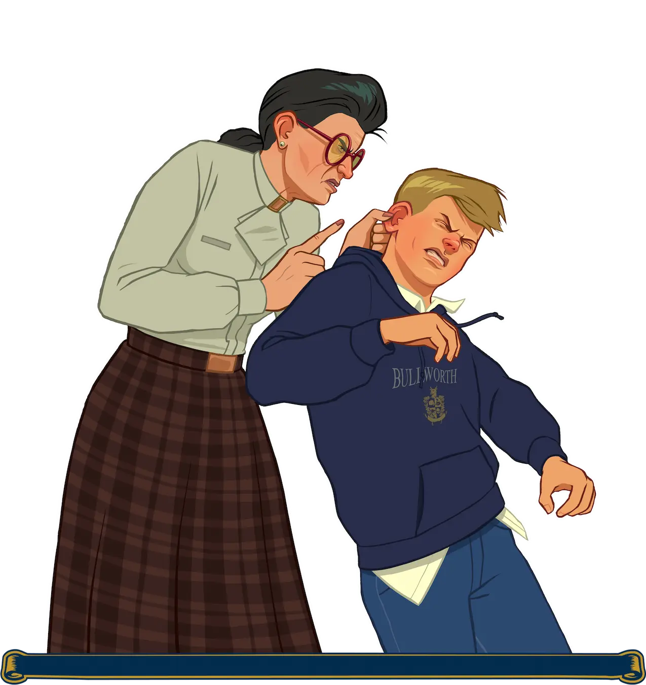

# Frequently Asked Questions

In this section, you may be able to find answers to some questions related to the build (the list will be updated).

??? note "How to change language?"
    In `Bully Scholarship Edition/ReadMe/Change Language` folder select a folder depend on your system: `32bit` or `64bit`, and select language you need:

        LANG-EN.reg - English (American)
        LANG-EN-GB.reg - English (British)
        LANG-FR.reg - French
        LANG-DE.reg - German
        LANG-IT.reg - Italian
        LANG-JP.reg - Japanese
        LANG-ES.reg - Spanish

??? note "Which Windows versions are supported?"
    Windows 7 SP1, 8 and 10.

??? note "Can I install third-party modifications to the build?"
    Yes, but please note that this can cause various technical problems/issues and you will lose our support in these matters.

??? note "Does original saves works?"
    Yes, but you may experience problems with content accessibility.

??? note "Can I play in 60 FPS?"
    Yes. But you will experience some bugs. Some lessons will be difficult and some missions cannot be completed.

??? note "Will there be Bully Multiplayer support?"
    No.

??? note "What version of the game is the Updated Classic based on?"
    1.200

??? note "Which languages are supported by this build?"
    American, British, French, German, Italian, Japanese and Spanish.

{ width="500" }