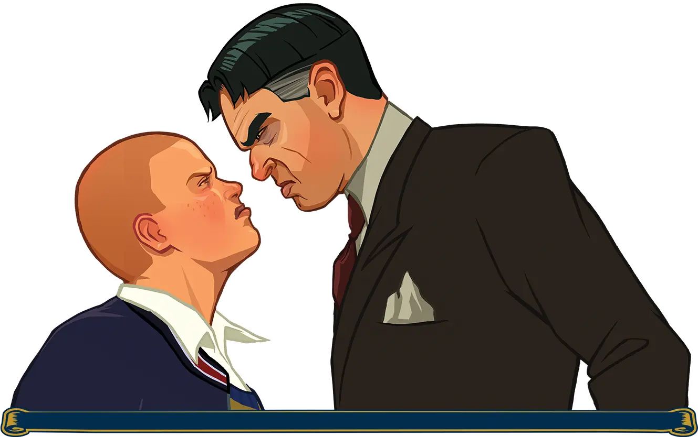
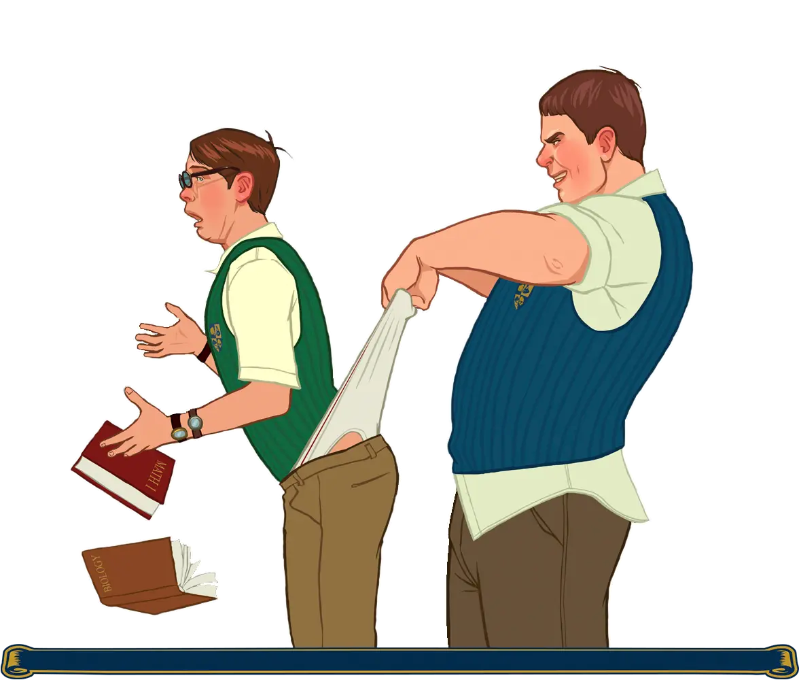

# Features

{ width="500" }

## Differences from the PC version

{ align=left width="300" }

**Changes from PS2 & Wii versions**:

- Textures (some are from beta).
- Weapons and radar icons.
- Vehicles.
- Photos of students in the yearbook from Wii.

**Fixes**:

- Added unused cutscenes.
- Improved one loading screen.
- Changed spawn (added faction leaders, pedestrians).
- Added scaffolding to academy's roof.
- Improved draw distance in some places.
- Added Christmas music in shops (only for winter).
- Collision loading code has been improved, fixing occasional crashes on initial game load.
- Fixed game’s objects pool usage, fixing possible crashes.
- Fixed an occasional crash when starting Nutcrackin’ or Music Class.
- Fixed numerous instances of memory corruption on game exit.
- Fixed an use-after-free in sound streaming code, causing a rare crash when talking to people.
- Fixed handle leaks in audio code, preventing handles from accumulating during the game.
- Fixed several memory leaks in audio code, preventing out of memory crashes during extended play sessions.
- Frame Limiter has been made much more precise, so the game should lock at exactly 30 FPS now (as opposed to stock limiter being prone to dropping frames a lot).
- Fixed an issue where game would use more CPU than required when minimized.

## Changelog

??? note "2022.01.23 - Build 2"

    - Fixed pink models and icons (build 1 bug).
    - Replaced photo of Gord and Lola in Jimmy's room.
    - Added "Mr. Barton and student" loading screen.
    - HUD in mini-games is taken from PS2.
    - Laptop in comic book shop taken from Wii.
    - The "Beam Cola" soda can now has one model.
    - Replaced school logos on clothes in school shop.
    - Changed fonts on classroom signs in school building.
    - Fixed texture of bike repair in Shop class.
    - Changed Hal's school logo.
    - Troy only wears jeans now.
    - Bob's hair colour has been changed, as well as his skin colour as in the cutscene.

{ width="500" }