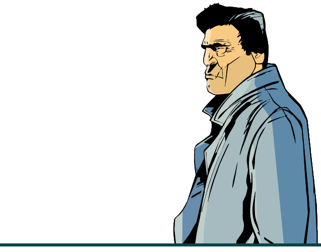

<!--  -->

In this section I suggest some interesting addons for your favorite game.
By default some of them already built-it and can be enabled via `modloader/modloader.ini` file.

**Just change value opposite needed addon on any digit above zero**
Examples:
!!! note "Enabling/Disabling addon (via modloader/modloader.ini)" 
    - Enabled
    ```(addon) breakable windshields = 100```
    - Disabled
    ```(addon) burstable tyres = 0```


1) Breakable windshields 
!!! note "" 
    `(addon) breakable windshields = 100`

2) Burstable tyres 
!!! note "" 
    `(addon) burstable tyres = 100`

3) Ability to move camera around the player like in GTA San Andreas
!!! note "" 
    `(addon) classic axis = 100`

4) Classic Interface (Original interface quality.)
!!! note "" 
    1. Download and unpack [[III] Classic Interface.zip](https://drive.google.com/file/d/1s7ux3IRG1zlAxrzyagu5nEhBgBMbF6_2) archive.
    2. Move content from ^^put in the game folder^^ folder to the game directory.
    3. `(dlc) classic interface = 100`

5) Destroyable airtrains
!!! note "" 
    `(addon) destroyable airtrain = 100`

6) Dynamic shadows
!!! note "" 
    `(addon) dynamic shadows = 100`

7) Hide wanted level like in GTA San Andreas
!!! note "" 
    `(addon) hide wanted level = 100`

8) No money zeros
!!! note "" 
    Removing zeros from money interface. For example, now you'll see "$350", instead of "$00000350".

    `(addon) no money zeros = 100`

9) Ability to move camera around the vehicle like in GTA Liberty City Stories
!!! note "" 
    `(addon) lcs vehicle camera = 100`

10) Claude animations from PC version
!!! note "" 
    `(addon) pc anims = 100`

11) PC radar and weapon icons
!!! note "" 
    `(addon) pc weapons and radar icons = 100`

    For 'Classic Interface' addon:

    `(addon) pc weapons and radar icons classic = 100`

12) Project 2DFX - Increase draw distance of light sources
!!! note "" 
    `(addon) project 2dfx = 100`

13) PS2 crosshair
!!! note "" 
    `(addon) ps2 crosshair ps2 weapons and radar icons = 100`

    For 'Classic Interface' addon:

    `(addon) ps2 crosshair ps2 weapons and radar icons classic = 100`

    For 'PC weapons and radar icons' addon:

    `(addon) ps2 crosshair pc weapons and radar icons = 100`

    For both 'Classic Interface' and 'PC weapons and radar icons' addons:

    `(addon) ps2 crosshair pc weapons and radar icons classic = 100`

14) Stingers

!!! note "" 
    `(addon) stingers = 100`

    ==Use this only with 'Burstable tyres' addon==
    

15) Borderless windowed mode
!!! note "" 
    `(addon) windowed mode = 100`

16) Ability to choose EAX, EAX 3.0, A3D and DirectSoundHW modes for users with Creative SoundBlaster sound card
!!! note "" 
    1. Download and unpack [[III] EAX Alchemy Fix.zip](https://drive.google.com/file/d/1WdgPJSgbSc5ed-H3Y0y-hz2KfK8A38pg) archive.
    2. Move content from put in the game folder folder to game directory.

