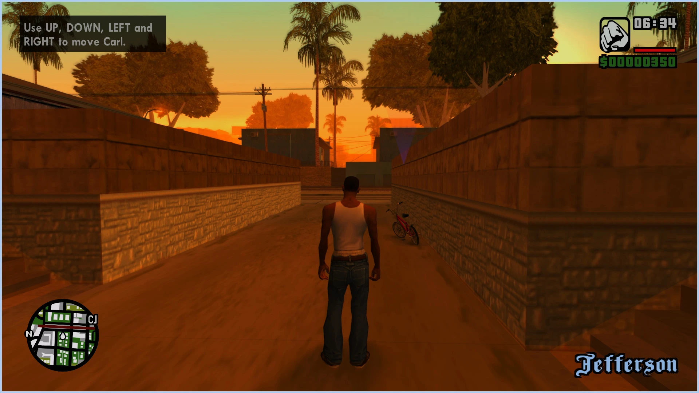
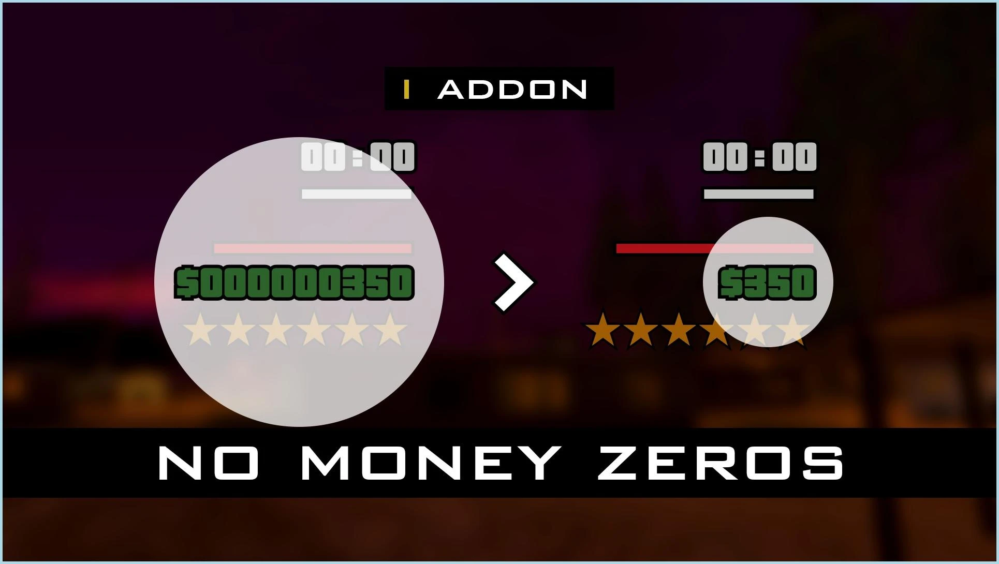

In this section we suggest some interesting addons for your favorite game.
By default some of them already built-it and can be enabled via `modloader/modloader.ini` file.

2)  HD Interface. (Exclusive version)
!!! note "" 
    1. Download archive [[VC & SA] HD Interfaces.zip](https://drive.google.com/file/d/1I0cxJdPZ3FPmyvitx9ToGQtdCjlgz8qX/view).
    2. Copy the content from a folder `[VC & SA] HD Interfaces\GTA San Andreas\put in game folder` and put it in `Grand Theft Auto San Andreas`'s directory.

    
    

2) No Money Zeros
!!! note "" 
    1. Download archive [[VC & SA] No Money Zeros.zip](https://drive.google.com/file/d/1HVrwvG7so6aQHw3hnioa2zGy29imqbVw/view).
    2. Copy the content from a folder `[VC & SA] No Money Zeros\GTA San Andreas\put in game folder` and put it in `Grand Theft Auto San Andreas`'s directory.

    

