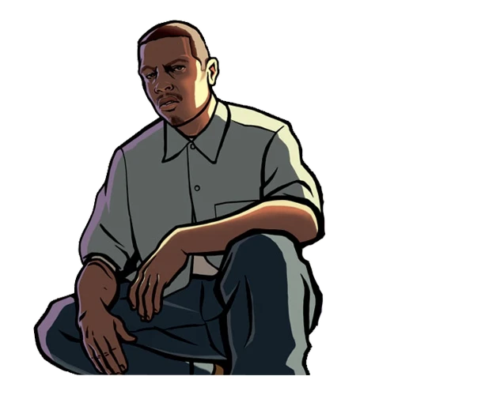

!!! note
    Updated Classic DOESN'T require original game or Steam. You can install a build and play Updated Classic without Steam.

    We have a build versioning that helps track changes and allows end users to determine how up to date their version is.. 
    
    Right now, ^^Build 37^^ is available for **Grand Theft Auto: San Andreas**.

You can download here : [Mega](https://mega.nz/folder/ao4ByTRa#tHdTLWa6hiUn-FzcmfqdEA/file/HgpS2R7I) / [Google Drive](https://drive.google.com/file/d/1VXUx8s9jtGU0roCH0-iswWb8IK9K1VQI/view) (Size: 4.35 GB)

## Install
Build works perfectly without Steam. But, if you want to play it through Steam, then follow the instructions below.    

So, you downloaded the archive and do not know what to do next.

1. **Remove the Steam Version:**  
    First, you need to remove all files from the original Steam version of the game. 

    To do this, click on the `Grand Theft Auto San Andreas` with the right mouse button in your `Steam library` and select `Properties` > `Local Files`> > `Browse Local Files`.... After this action you will have to open the folder with the game files. Just delete them all.

2. **Installing Normal Version of the game:**  
Now everything is simple. All you have to do is unpack UC GTA San Andreas Build archive, take all the files from it's root directory and move it to your steam-version folder (which must be empty). When you move (or copy) all these files, you'll be ready to play.

3. **Install all necessary components for the game from the folder ReadMe/Prerequisites.**  
This is necessary so game itself and installed mods work properly. You may think, that it's not really necessary installing these libraries, but it can give a guarantee, that you won't see an error like "Can't find file.dll". We truly recommend to install it because it's useful not only for this build, but for any other games.

    - DirectX Pack - `ReadMe/Prerequisites/Direct X/DXSETUP.exe`
    - Runtime Pack - `ReadMe/Prerequisites/Runtime Pack/RuntimePack_x86_x64.exe`
    - Visual C++ Redistributable Hybrid - `ReadMe/Prerequisites/Visual C++ Redistributable Hybrid/VCR_Hyb_x86_x64_24.04.2019.exe`

!!! note
    If you want to install the build without downloading the Steam version of the game, you can simply use the {++.acf++} file from the archive below, which is responsible for having the installed game on Steam.
Download:
[Mega](https://mega.nz/folder/ao4ByTRa#tHdTLWa6hiUn-FzcmfqdEA/file/D9olQb4K) / [Google Drive](https://drive.google.com/file/d/1PIGmoXOuI6EXkFPmktnnszwqQ_oGxwY7)

Put file in `Steam\steamapps` folder, after installation, restart Steam.
Content of the archive:

- `appmanifest_12100.acf` - File for Grand Theft Auto III
- `appmanifest_12110.acf` - File for Grand Theft Auto: Vice City
- `appmanifest_12120.acf` - File for Grand Theft Auto: San Andreas

## Pre-launch 

Recommendations before start the game:

1. **Turn on Frame Limiter in game display settings.**

    This is necessary for the game to work correctly. Since the game was not designed for high FPS, all sorts of problems appear because of it: some missions do not load, physics breaks.
    Rockstar's official ReadMe also contains this recommendation.

2. **Make sure, that you have installed all necessary components for the game.**

    If you're not sure about this, you certainly need to visit Readme/Prerequisites and install:

    - DirectX Pack - `ReadMe/Prerequisites/Direct X/DXSETUP.exe`
    - Runtime Pack - `ReadMe/Prerequisites/Runtime Pack/RuntimePack_x86_x64.exe`
    - Visual C++ Redistributable Hybrid - `ReadMe/Prerequisites/Visual C++ Redistributable Hybrid/VCR_Hyb_x86_x64_24.04.2019.exe`

3. **Set the value of anisotropic filtering in the settings of your video card to the maximum value available.**

    This will make the textures look as good as possible. Without anisotropic filtering, textures (mostly roads) will be blurry at close range.

If you have any technical problems/questions, see the  section. ["Frequently Asked Questions"](../gtasa/faq.md)

!!! tip "If you still have problems with the build" 
    Contact with us on our Discord server ("🔨｜support" channel). If the build has crashed, please attach these files to your report message
    
    - Grand Theft Auto San Andreas/modloader/modloader.log.
    - Grand Theft Auto San Andreas/cleo.log.
    - Grand Theft Auto San Andreas/scripts/scrlog.log.
    - Grand Theft Auto San Andreas/scripts/moonloader/moonloader.log.
    - Grand Theft Auto San Andreas/scripts/ucic.log.

## Installing updates
!!! warning
    With each update, we completely re-upload the build. So, to install the update, you need to download the new Updated Classic build and unpack it into a clean folder.
    **Never install the update over the previous build!**

