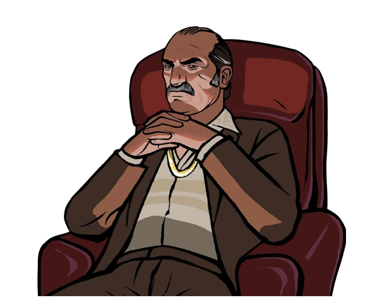

# Frequently Asked Questions

In this section, you may be able to find answers to some questions related to the build (the list will be updated).

??? note "Can I install third-party modifications to the build?"
    Yes, but please note that this can cause various technical problems/issues and you will lose our support in these matters.

??? note "Which Windows versions are supported?"
    Windows 7 SP1, 8 and 10.

??? note "Will there be San Andreas Multiplayer, Multi Theft Auto or GTA Connected support?"
    Not planned.

??? note "The game is very laggy"
    1. Open file `Grand Theft Auto San Andreas/scripts/Mix Sets.ini` and change the value of `Anisotropic parameter` to `2`, `4` or `8`.
    2. Open file `Grand Theft Auto San Andreas/scripts/skygfx.ini` and change the value of `radiosity` parameter to `PS2`.
    3. Delete file `Grand Theft Auto Vice City/mss/scrlog.asi`.

    ==WARNING! If you'll complete a second step - there can be problems with support!==

??? note "How to active a Windowed mode?"
    In `Advanced Display Settings` (in game) in `resolultion` find a windowed value.
    Or
    Put file `ReadMe/Windowed Mode/III.VC.SA.WindowedMode.asi` to `scripts` and you will have bordersless windowed mode.

??? note "How can I activate the tool tips with the PS2 gamepad buttons?"
    In the `Grand Theft Auto San Andreas/scripts/GInputSA.ini` file, set the `PlayStationButtons` parameter to `1`.

??? note "When I try to extract files from the archive, I got an error: Can not open file or Archive corrupted."
    Update your archiver or use another.

??? note "After installing build, my saves made on Steam-versions stopped working."
    A Guide to Converting Saves:
    
    1. Go to `gtasnp.com` and upload your save file there (located in `MyDocuments/GTA San Andreas User Files/GTASAsf1.b` - where the digit 1 inthe file name indicates the slot number).
    2. After uploading the file to the site, expand the Modifications section.
    3. Change the value of `Binary/EXE Version` to `unmodified`.
    4. Change the value of `Script/SCM Version` to `v1`.
    5. Below choose one of the eight slots in which you want to save yourfile and put it back in `My Documents/GTA San Andreas User Files`.

??? note "I like to remove dynamic shadows but don't want to lose other effects."
    Open the file `Grand Theft Auto/San Andreas/scripts/skygfx.ini`, then set the parameters `pedShadows` and `stencilShadows` to `0`.

??? note "Game doesn't launch / When resolution setting identical to the resolution of the monitor, the game freeze/crashes / Cannot find "1x1x1" video mode."
    1. In properties of `gta-vc.exe` go to `Compatibility`, select `Change high DPI settings` and turn ON following parameters:
    "`Program DPI`: when I open this program"
    "`High DPI scaling override`: `Application`".
    2. In the file `Grand Theft Auto Vice City/scripts/GTAVC.WidescreenFix.ini` in the parameters `ResX` and `ResY` set the resolution values of your monitor.
    Example:
        `ResX = 1920`
        `ResY = 1080`
    3. Install `DirectPlay`.
    4. Delete file `My Documents/GTA Vice City User Files/gta_vc.set`.
    5. Set the `Compatibility` with `Windows XP` or `Windows 7`.

??? note "How to enable/disable the "black borders" in cutscenes?"
    In `Advanced Video Settings` (in game) turn on "Widescreen" feature.

??? note "When launching via Steam, the game crashes without error after the intro clips."
    Make sure that the game and Steam are installed on the same drive.

??? note "When the game starts, a red sing “`ERROR: Fail to load 'IndieVehSmoke.asi'” appears.`"
    Move the `IndieVehSmoke.asi` file from `SA/scripts` to the game directory.

??? note "When the game starts, it minimizes to the window and instead of the game I see a black screen."
    Rename the `gta-sa.exe` file to `gta_sa.exe`.

??? note "Some sounds are missing."
    In the tray, clock on the speaker with the right mouse button, then '`Open Sound Settings`', then '`Sound Control Panel`', click on the active speakers, select "`Configure`" and select "`stereo`".

??? note "The game freezes while using mouse."
    Set the polling rate of your mouse to 125 Hz.

??? note "I like to return a blur like on PS2 version."
    Open file `scripts/skygfx.ini` and set following settings:

        blurLeft = 8
        blurTop = 8
        blurRight = 8
        blurBottom = 8
        radiosityFilterPasses=1

??? note "How to setup controls on gamepad?"
    In the `Scripts/GinputSA.ini` file, you need the "ControlsSet" option. All available control "sets" can be found in the file `ReadMe/Ginput docs/GAME CONTROLS FULL LIST.txt`.

??? note "I have a resolution different than 16:9, the menu screens and loadscreens do not fit on the monitor."
    Open file `Scripts/GTASA.WidescreenFix.ini`, find `ForceAspectRatio` parameter and change it's value to your aspect ratio.
    Example:
    `ForceAspectRatio = 16:10`

??? note "Which languages are supported by this build?"
    English, French, German, Italian, Spanish and Russian.

??? note "When playing as a second player, how get into the car as a passenger?"
    Open `SA/cleo/Two Player Missions/Two Player Missions Options.ini` and change value of `EnterSeparateVehicles` parameter to `0`.

??? note "I'd like to remove 'yellow' filter."
    Open file `scripts/skygfx.ini` and set value `PC` to `colorFilter` parameter.

??? note "Does this build contains all tracks that was cut?"
    Sure, build has all original audio and tracks from game.

??? note "An error before startup: "Unable to load `rundll32exefix.asi`. Error: 193""
    Move `rundll32exefix.asi` file from scripts folder to game directory.

??? note "What version of the game is the Updated Classic based on?"
    1.0

??? note "Game crashing at loading screens."
    Make sure that your anti-virus didn't delete any game files. Add a game folder to exceptions and reinstall build.

??? note "The game crashes in San Fierro docks near Import/Export ship."
    Your savegame file has been corrupted by extremely unlikely bug when blackboard with vehicles list for Import/Export has disappeared. Install this script into `Grand Theft Auto San Andreas/cleo` folder, overwrite your savegame file and remove this script.
    Install [this script](https://drive.google.com/file/d/1K7Kn8Ij_QR7QHt6bm468fo_TZq2tFGht) **ONLY** if you have a crash in San Fierro docks!

??? note "There is an invisible/non-solid object in alley near Zero's RC shop. / There is many low-poly objects in Richman and Mulholland."
    This is a problem of savegame file.

??? note "When the game starts, the window with the message "`AppId is not configured`" comes out."
    Delete the file `Grand Theft Auto San Andreas/scripts/GInputSA.asi.`
    
    **Note: After this, support for gamepad will be lost.**

 