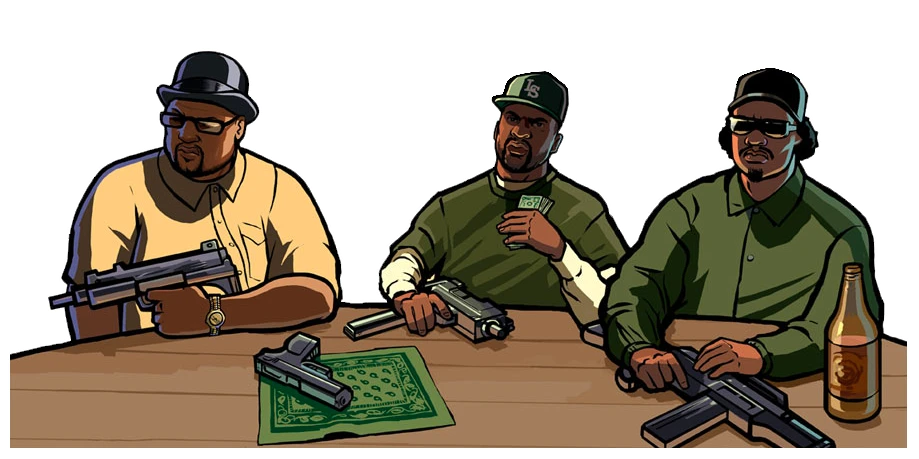
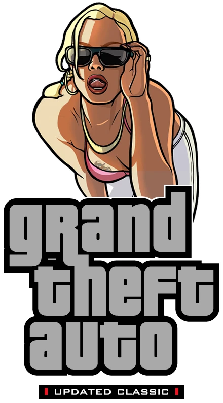
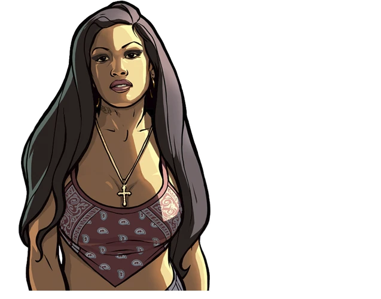
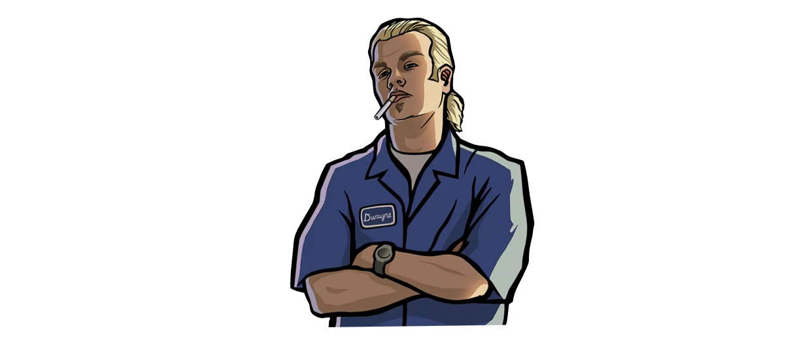

# Features

## Differences from the PC version 

{ align=left width="300" }

**Changes from PS2 version:**

- Co-op, with all original modes (Free roam, Rampages).
- Some special objects from PS2 & Xbox versions.
- Script differences.
- Setting the weather and the atmosphere.
- Radar icons.
- Radio stations icons.
- Grass.
- Parked cars.
- Objects, models and textures which different on PC version.
- Text on the walls in the Ammu-Nations.
- Vehicles.
- Text files.
- Some effects.
- Reflections on the vehicles.
- Unused Pay'n'Spray in Las Venturas (Fixed).
- Markers.
- Loadscreens without compression.
- Art with Gant bridge in game menu.
- Destroyable statues in atrium.

Many of the above can be seen in the [Demonstration](demonstration.md) section. 

## Fixes 

- Enemy groups are now hitting your car in free mode.
- Fully working Hot Coffee mod. (It is activated and deactivated by the cheat - code "HOTCOFFEE").
- The game allocated more memory, which fixed the problem with the disappearance - of textures.
- Pedestrians now do not disappear when you point camera at them.
- The noise with rain have been removed.
- Fixed "black roads" bug.
- Now when you use Alt + Tab, the game is not paused. (This fixed the problem - with textures on the whole screen in the interiors).
- When an airplane exploded (when a player was inside), it no longer disappears.
- The "secret" Pay'n'Spray in Las Venturas has been restored and fixed.
- In the desert now appears the sheriff of the desert (in the original was the - sheriff of the countryside).
- "Red Rain" has been fixed.
- Various fixes on the map (including interiors).
- Fixed the "black side" of palms and trees.
- Now you have access to the San Fierro police department.
- On the mission "Life's a beach" to get a van, you now need to score 4000 - points, as on PS2 (2500 on PC).
- In the first cutscene, the train is now are moving with the correct speed, as - on the PS2.
- The siren in the mission "Black Project" was restored from the PS2.
- Fixed a problem with anti-aliasing and reflections in mirrors.
- The game now has a windowed mode.
- The night sky has been corrected.
- The light from the headlights was fixed.
- Various transport fixes. (Exclusive version)
- A double pair of wheels at the trucks.
- Parachute animations was restored.
- The mouse now works correctly.
- The mouse no longer goes beyond the screen, which allows you to play on - multiple monitors.
- The sensitivity of the vertical axis of the mouse now corresponds to the - sensitivity along the horizontal axis.
- More accurate counting of frames per second. Now frame limit is 30 (in default - 25, 26 in Steam).
- Fixed reflections on wet roads.
- All text now has correct shadows (depending on the selected resolution).
- In the folder "ReadMe" you can find manuals for the game.
- Added mip-map levels for all game textures.
- Added full support for gamepads.
- The interface now has the correct size relative to the screen resolution.
- Various script fixes.
- The NUM5 key works correctly (as in 1.01).
- Now, if the game does not have a configuration file, then the resolution in the game will default to the resolution of your computer's screen (instead of the standard 800x600).
- DirectPlay is no longer required for the game.
- The size of the subtitles and radio stations is reduced, as in the Steam - version.
- Fixed glare of the sun.
- Fixed a bug due to which melee weapon spawned by cheat code was replaced by - another weapon when entering the marker.
- Rotors of helicopters and airplanes now work correctly.
- Hunter's interior no longer disappears when you look at it through the glass.
- Lighting on objects no longer changes when changing weapons.
- Fixed a bug with the disappearing weapon icon on the jetpack.
- Blown up cars no longer shine.
- Fixed a problem with dirty vehicles. Now you can dirty and clean your cars in - Pay'n'Spray (as in 1.01).
- The moon now has several phases (depending on the day of the week), as on the - PS2.
- Fixed lighting of objects.
- User Tracks now support the FLAC format. (Only 8/16/24 bit, Mono / Stereo and - up to 48 Khz).
- Temple and Queens are now properly reported by the police.
- Fixed a problem with the gym, when you forever could not use it.
- Fixed dumbbells in gyms.
- Saving in the Madd Dogg's house no longer causes a problem with the basketball.
- Cheat code for floating vehicles from PS2 (Activation/deactivation - - "SEAROADER").
- Cops textures in "Reuniting The Families" and Quarry missions have been fixed.
- All music on the radio is present, unlike the standard Steam version.
- Fixed facial animations.
- Cut art in main menu was restored.
- Trains now have a glow effect from the headlights.
- The tram now has a dynamic change of sign (depends of area).
- Ryder's number 9 in the "Drive-thru" mission now has the correct textures.
- Fixed a problem with the aero on Windows 7.
- Fixed a problem with long characters hands, when using skin mods.
- Fixed problems with the radar render.
- Improved smoke effects from car exhaust pipes.
- ==[Exclusive]== Fixed wheelchair.
- Fixed Micro Uzi & ==[Exclusive]== M4 models.
- All in-game models of story characters has improved.
- ==[Exclusive]== Improved all billboards.
- ==[Exclusive]== In mission 'End Of The Line' all bosses now have a correct weapons.
- Added HD icon of the game (can be found in data/Icons folder).
- ==[Exclusive]== Fixed casino guard in 'Key To Her Heart' mission.
- Fixed Big Smoke statue in Crack Palace.
- Many animations was fixed.
- ==[Exclusive]== Added radar icons for gym on Verona Beach, The Well Stacked Pizza - Co. in Montgomery, barber shop in El Quebrados and Pay'n'Spray in Royal Casino.
- Radars in airports are now animated (like in GTA VC).
- ==[Exclusive]== Hydra pilots replaced with soldiers in 'N.O.E.' mission.
- Game now can use up to 4 GB RAM.
- Weather's colors now change every hour (like GTA III & VC) instead of every 8 - hours.
- The amount of money that drops from a prostitute after interacting with her, - now depends on how much money the player spent.
- Rancher now have a correct model with black windows in 'Lure' mission.
- Phoenix now have an animated engine.
- Newsvan now have an animated antenna.
- Fixed taxi lights. Now lights active only when taxi is free.
- Fixed taxi lights in 'Taxi Driver' mini-mission.
- ==[Exclusive]== Now taxi driver uses a correct model in 'Snail Tail' mission.
- Improved Mission Packs loading. And now limit of Mission Packs is 10.
- Restored unused paintings in The Johnson's House.
- Fixed some shoes.
- ==[Exclusive]== Fixed Leviathan color in police radio.
- ==[Exclusive]== Big textures research. Many textures was replaced with their better - analogs (not HD).
- Text fixes.
- Many models fixed.
- Fixed aiming movement with high FPS. (But it's still a problem thing)
- Fixed low shadows height.

## Changelog

??? note "2021.05.14 - Build 37"

    - ==[Exclusive]== Added integrity check system for Updated Classic build. If some files was modded or deleted, you'll see a special error window. Check can be disabled in INI file.
    - ==[Exclusive]== Fixed invisible Cluckin' Bell menu sign in Willowfield.
    - ==[Exclusive]== Removed all speed limits around the map (for example, Strip in Las - Venturas).
    - ==[Exclusive]== Minor vehicles fixes.
    - Fixed M16 model in 'Stowaway' intro cutscene.
    - ==[Exclusive]== Added complete interance in SFPD HQ.
    - ==[Exclusive]== Numerous collision fixes.
    - ==[Exclusive]== Numerous collision materials fixes (shots effects, footsteps - sounds, grass brightness)
    - ==[Exclusive]== Barriers added to all railway crossings in Los Santos.
    - Fixed visual problems when using ITB and arcade machines.
    - ==[Exclusive]== LOD model of railway bridge in San Fierro (Kincaid Bridge) now has  - a lighting.
    - ==[Exclusive]== Denis Robinson was replaced with hookers in 'A Home In The Hills' - mission.
    - ==[Exclusive]== Restored unused voices for peds WMYSGRD (id 71) and BMYPIMP (id     - 249) (there was a syntax error in the text file ).
    - ==[Exclusive]== Guards in mission 'Custom Fast Track' now have a WMYSGRD skin - because a voicelines of this skin is using in mission.
    - Fixed some invisible or visible by one side objects.
    - Fixed a problem when a player's dynamic shadow was disappearing after AltTabing - the game.
    - Fixed all problems with Advanced Driving School on an old UC saves.
    - Fixed a bug with Driving School in 'Outrider' mission.
    - ==[Exclusive]== Numerous fixes on map: corrections of objects positions (some of - them was under or above ground), added missing textures.
    - Fixed all wrong vehicles colors.
    - Fixed a problem with getting a private dance in "The Pig Pen" and "Old Venturas - Strip Strip Club"
    - Removed visual filter on the end credits.
    - Removed Quadbike and Cart from Madd Dogg's Crib.
    - Fixed burning issues with story characters in "Mountain Cloud Boys" and "Mike - Toreno" missions.
    - ==[Exclusive]== Now all passengers don't change their sits in 'Drive-Thru' mission.
    - Fixed a problem with access to Ammu-Nation in 'Doberman' mission.
    - ZR-350 in cutscenes are now black just like on PS2 and 'Farewell, My Love...' - race.
    - ==[Exclusive]== Fixed parked cars in Seville. Now they no longer going down the - ramp to the road.
    - Roadblocks between the cities now have a proper collision.
    - ==[Exclusive]== Fixed player spawn position when exiting from Safe House near - Driving School.
    - ==[Exclusive]== After completing 'Custom Fast Track' you will see a Jester in Wang - Cars instead of Savanna.
    - ==[Exclusive]== Train's wheels are now animated.
    - Fixed problems with tunning Flash.
    - ==[Exclusive]== Now game don't changing player's haircut in 'Breaking The Bank at - Caligula's' mission.
    - Fixed a Safe House door in Redsands West.
    - All race maps replaced with final version of the map.
    - ==[Exclusive]== Pickup of 'yay' (dropping from Big Smoke's courier) was changed to - more correct model instead of beta parachute.
    - Added 'Amazing Screenshot' mod. Simply press Alt + V while playing and make a - screenshot of your moment!
    - ==[Exclusive]== Removed all mentiones of heart attack since it's a myth.
    - Escalators are now works properly with FPS lower than 60.
    - ==[Exclusive]== Fixed an old glich with Freeway, FCR-900 and NRG-500 spawn around - Bike School.
    - ==[Exclusive]== Fixed problems with Aztec's territories getting under Vagos control - in walkthrough.
    - ==[Exclusive]== Minor fixes in subtitles text.
    - ==[Exclusive]== Added 3th Vagos skin in Wrong Side of the Tracks just like in - cutscene.
    - CSR radio frequency changed back to 103.9 like in PC version and official - guides. On PS2 it was 103.2. Probably a mistake.
    - Fixed weird path of first oncoming train in 'Snail Trail' mission (when train - goes from tracks to sky).
    - Fixed cutscenes in 'Drive-Thru' mission:
        - In the intro scene, now the camera is a little higher so you can't see the - characters floating at the end. (you would never seen it on UC since UC are - using original cutscenes FOV)
        - The famous dos "t-pose" has been corrected. Now the characters appear inside - the car and close to the scene. (you would ver seen it on UC since UC are - using original cutscenes FOV)
        - Fixed CJ's mouth being pursed by a frame when talking to Sweet.
        - Fixed CJ's mouth not moving on his last speech.
        - Ballas members now appear inside the Voodoo (fixed the ghost car).
        - Fixed the characters disappearing on the screen in the last frame.
    - Fixed mirrors in Woozie's apartaments and Caligula's office like on PS2.
    - Improved game optimization in resource consumption.
    - ==[Exclusive]== Discord RPC - This script shows a lot of information in your Discord profile about what is happening in the game when you're playing it!
        Features:
        - Current weapon;
        - Current weapon's ammo;
        - Current health;
        - Current armor;
        - Current amount of money;
        - Current wanted level;
        - Current time in game;
        - Current state on foot/in vehicle/on jetpack;
        - Current area name when on foot/on jetpack;
        - Current interior's name when on foot/on jetpack;
        - Current 'on mission' state;
        - Current mission name (include video games and mini-games) when on a mission;
        - Current progress made (in percentages);
        - Current radio-station when in vehicle;
        - If there is no radio in current vehicle, script also reports it;
        - Current vehicle's health (in percentages);
        - If a player is wasted;
        - If a player is busted;
        - Game paused.
    - Plugins and scripts updated.
    - Fixed timing of giving a damage with kick boxing punch on the run.
    - Corrected visual part of the game.
    - Fixed 'Gun' tattoo (AK-47 on the back).
    - S.W.A.T. are using Micro-UZI again.
    - Gangsters no longer crouch in fear during gunfights.
    - Now, when hitting different objects with melee weapons, there will be a - corresponding sound.
    - ==[Exclusive]== Sun's size are now automaticly adapts to draw distance.
    - ==[Exclusive]== Restored gym, pizza and barber icons are now appears with other by - completing a specific missions.
    - ==[Exclusive]== Now the Triads and Aztecs will treat the player and his gang well - as they progress through the story.
    - ==[Exclusive]== Peds VBMOCD (id 182), SMYST (id 241), SMYST2 (id 242), HECK1 (id - 258), HECK2 (id 259), BMOCD (id 262) and WMOICE (id 264) are now using 'fatman' - animation from Big Smoke.
    - Restored original gunflashes effects.
    - ==[Exclusive]== Claude are now driving Elegy in 'Farewell, My Love...' race instead - of Woozie.
    - ==[Exclusive]== Added a texture for a black sun hat. Originally, a texture was a - small black square.
    - Title screen changed to PC version.
    - ==[Exclusive]== Gamepad buttons replace with PS2 & Xbox Original versions.
    - Improved numerous 2dfx effects in Jizzly's club.
    - ==[Exclusive]== Fixed a bat pickup height in 'Cleaning The Hood' mission.
    - Fuel calculation and RC Baron health in 'Supply Lines...' mission now the same - as on PS2.
    - Fixed all mistakes on the radar/map when it didn't matches the actuall terrain.
    - HD Interface
        * ==[Exclusive]== All race maps replaced with final version of the map.
        * More correct font.
        * Title screen changed to PC version.
        * Improved RPG crosshair.
        * Fixed a problem when HD textures for race maps and videogames didn't load.
        * Fixed all mistakes on the radar/map when it didn't matches the actuall terrain.

    - Removed addon "Co-op Anytime".
    - Removed addon "Extra Draw Distance".

