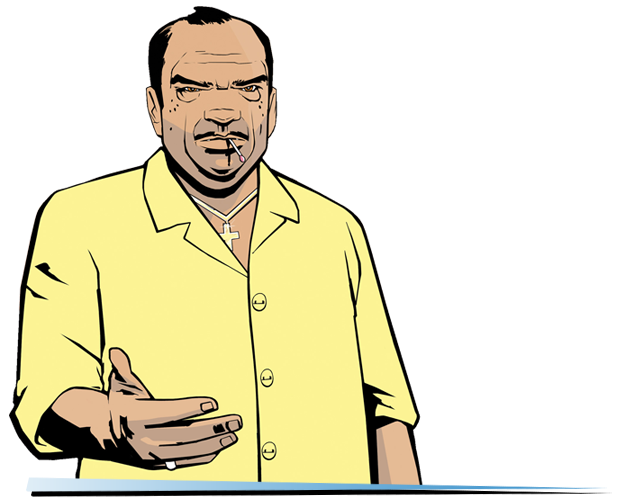

# Frequently Asked Questions

In this section, you may be able to find answers to some questions related to the build (the list will be updated).

??? note "Can I install third-party modifications to the build?"
    Yes, but please note that this can cause various technical problems/issues and you will lose our support in these matters.

??? note "Which Windows versions are supported?"
    Windows 7 SP1, 8 and 10.

??? note "Will there be Vice City Multiplayer, Multi Theft Auto or GTA Connected support?"
    Not planned.

??? note "The game is very laggy"
    1. In file `Grand Theft Auto Vice City/scripts/GTA3.WidescreenFix.ini` set for parameter `ForceMultisamplingLevel` value `0`.
    2. Delete file `Grand Theft Auto Vice City/mss/scrlog.asi`.

    ==WARNING! If you'll complete a second step - there can be problems with support!==

??? note "Game doesn't launch / When resolution setting identical to the resolution of the monitor, the game freeze/crashes / Cannot find "1x1x1" video mode."
    1. In properties of `gta-vc.exe` go to `Compatibility`, select `Change high DPI settings` and turn ON following parameters:
    "`Program DPI`: when I open this program"
    "`High DPI scaling override`: `Application`".
    2. In the file `Grand Theft Auto Vice City/scripts/GTAVC.WidescreenFix.ini` in the parameters `ResX` and `ResY` set the resolution values of your monitor.
    Example:
        `ResX = 1920`
        `ResY = 1080`
    3. Install `DirectPlay`.
    4. Delete file `My Documents/GTA Vice City User Files/gta_vc.set`.
    5. Set the `Compatibility` with `Windows XP` or `Windows 7`.

??? note "Intro movies don't work."
    Set `Compatibility` with `Windows XP Service Pack 3` and install codecs.

??? note "In the game, instead of all the radio stations, "Wildstyle" are playing."
    1. Set to all files in folder `Grand Theft Auto Vice City` (besides .log   files) value `Read-only`.
    2. Move file `Grand Theft Auto Vice City/ReadMe/install.bat` to `Grand Theft Auto  Vice City`.
    3. Run `Grand Theft Auto Vice City/install.bat (as administrator)` and wait until it's finish work.
    4. Reboot your system.

??? note "After installing build, my saves made on Steam-versions stopped working."
    A Guide to Converting Saves:
    1. Go to gtasnp.com and upload your save file there (located in `My Documents/GTA Vice City User Files/GTAVCsf1.b` - where the digit 1 in the file name indicates the slot number).
    2. After uploading the file to the site, expand the Modifications section.
    3. Change the value of `Release Version` to `Retail` (Windows) or Steam (Mac OS X).
    4. Below choose one of the eight slots in which you want to save your file and put it back in `My Documents/GTA Vice City User Files`.

??? note "How do I activate the tool tips with the PS2 gamepad buttons?"
    In the `Grand Theft Auto Vice City/mss/GInputVC.ini` file, set the "`PlayStationButtons`" value to `1`.

??? note "When I try to extract files from the archive, it gives an error: Can not open file or Archive corrupted."
    Update your archiver or use another.

??? note "How to enable/disable the "black borders" in cutscenes?"
    In Display Setup (in game) turn on "Wide screen" feature.

??? note "When launched via Steam, the game crashes without error after the intro clips."
    Make sure that the game and Steam are installed on the same drive.

??? note "How to setup controls on gamepad?"
    In the `mss/GinputVC.ini` file, you need the "`ControlsSet`" option. 
    
    All available control "sets" can be found in the file `ReadMe/Ginput docs/GAME CONTROLS FULL LIST.txt`.

??? note "I have a resolution different than 16:9, the menu screens and loadscreens do not fit on the monitor."
    Open file `Scripts/GTAVC.WidescreenFix.ini`, find `ForceAspectRatio` and
    `FrontendAspectRatio` parameters, then change it's value to your aspect ratio.
    Example:

        ForceAspectRatio = 16:10
        FrontendAspectRatio = 16:10

??? note "Which languages are supported by this build?"
    English, French, German, Italian, Spanish and Russian.

??? note "How to activate Windowed Mode?"
    Put files `ReadMe/Windowed Mode/wndmode.asi` & `wndmode.ini` to `scripts` and you will have bordersless windowed mode.

??? note "I like to return a blur like on PS2 version."
    Delete file `Scripts/SharpTrails.asi`.

??? note "Does Updated Classic contain Haitians friendly content changes?"
    No, the game is presented in it's original state.

??? note "I like to remove 'yellow' filter."
    In Display Setup (in game) turn off "Trails" feature.

??? note "When the game starts, the window with the message "AppId is not configured." comes out."
    Delete the file `Grand Theft Auto Vice City/mss/GInputVC.asi`.
    
    **Note: After this, support for gamepad will be lost.**

??? note "Does this build contains all tracks that was cut?"
    For GTA Vice City they never cut any tracks. Build has all original audio and tracks from game.

??? note "An error before startup: "Unable to load `rundll32exefix.asi`. Error: 193"
    Move `rundll32exefix.asi` file from scripts folder to mss folder.

??? note "What version of the game is the Updated Classic based on?"
    1.0

??? note "Game crashing at loading screens."
    Make sure that your anti-virus didn't delete any game files. Add a game folder to exceptions and reinstall build.

??? note "The game crashed when trying to connect a gamepad."
    Install [latest version of Ginput plugin](https://silent.rockstarvision.com/uploads/GInputVC.zip). 

    Remove `GinputVC.asi` and `Ginput.ini` files from `Grand Theft Auto Vice City/mss` and install new ones into `Grand Theft Auto Vice City/scripts`.

    **Warning: After updating the plugin you will experience performance troubles on the end credits (FPS will be around 10-15).**
    

??? note "All weapons in game are invisible."
    Download  [this archive](https://drive.google.com/file/d/16GEWZ4xjrd10leoRvWwLv7H7Ufl2jQQW), unpack it and move all content from put in game folder to `Grand Theft Auto Vice City` folder.

??? note "There is a white lines on characters."
    This is a Widescreen Fix's anti-aliasing issue. You can disable it in `Grand Theft Auto Vice City/scripts/GTAVC.WidescreenFix.ini` file, set `ForceMultisamplingLevel` to `0`.

 