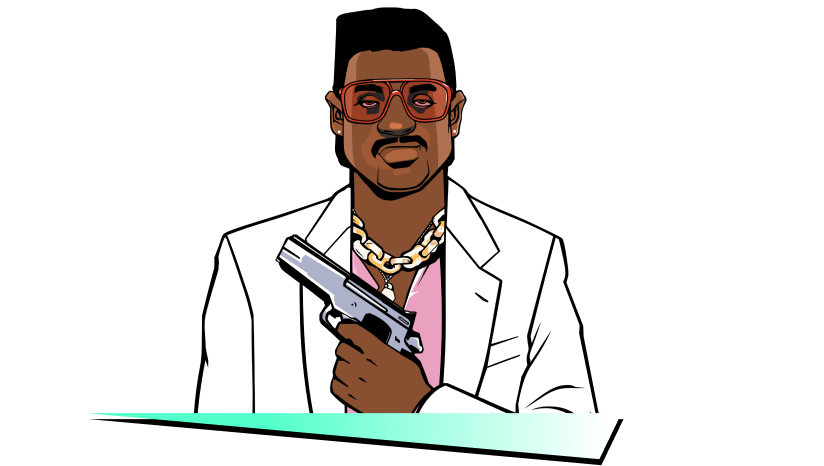
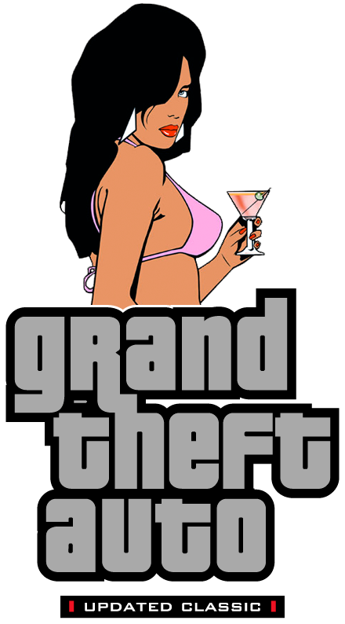
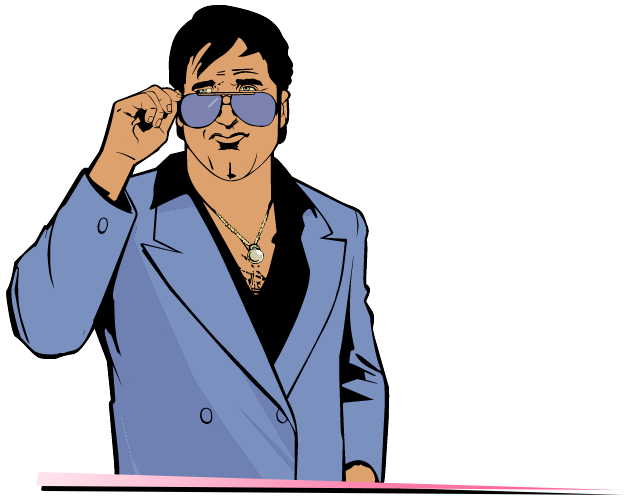
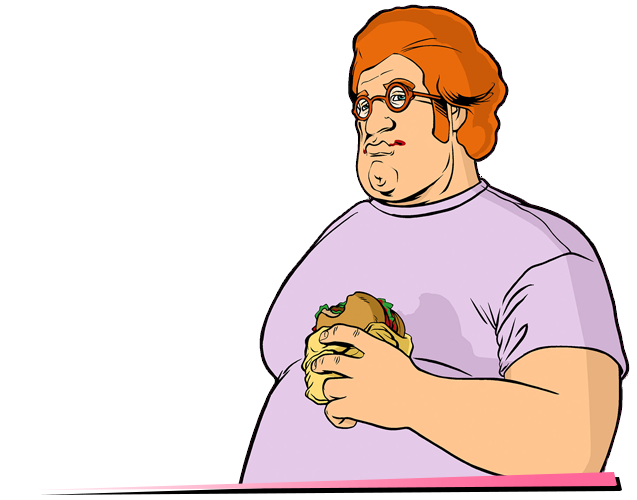

# Features

## Differences from the PC version 

{ align=left width="300" }

**Changes from PS2 version:**

 - IDLE animation with two-handed weapons.
 - Some songs from Flash FM, Wave 103, V-Rock, VCPR and K-CHAT.
 - Restored teargas' damage and pickup.
 - Vehicles.
 - Weapons and radar icons.
 - Setting of the weather.
 - Loading screens (replacing each other, instead of one static one in PC version).
 - Weapons.
 - Color correction.
 - Textures that different on the PC.
 - Auntie Poulet's clothes color.
 - Text files.
 - Effects: Fire, rain, smoke and water spray.
 - Interface style.
 - Camera when getting in car.
 - Police radio dispatch voice sound.
 - Grenade sounds.
 - Headlights now work correctly.
 - Property pickups.

Many of the above can be seen in the [Demonstration](demonstration) section. 

## Fixes

- Fixed an issue where when the game was installed on drive A or B, the game - requested a CD.
- The mouse now works correctly.
- The mouse no longer goes beyond the screen, which allows you to play on - multiple monitors.
- The vertical axis of mouse sensitivity now corresponds to the horizontal axis.
- A more accurate frame count per second, which removes lags when the frame - limiter is on.
- Fixed reflections on wet roads.
- Backlight pickups has been fixed.
- All text now has correct shadows (depending on the selected resolution).
- Codes of police were corrected while reporting information about the player.
- Fixed a bug due to which the melee weapon spawned by the cheat code was - replaced by another melee weapon when entered in marker.
- Some details in the club Malibu, Ocean View Hotel and Pole Position Club were - restored.
- In the folder "ReadMe" you can find the manual & map for the game.
- Map fixes.
- Added mip-map levels for all textures.
- Added full support for gamepads.
- The interface now has the correct size relative to the screen resolution.
- A lot of properly parked vehicles.
- Added windowed mode.
- Improved tear gas.
- Fixed some problems with sound.
- Fixed pedestrian traffic lights.
- The message 'Come back when you have finished the Biker gang missions.' is - showing for 4 seconds instead of 1.
- Duration of Pole Position mission complete cutscene is slightly longer.
- The Infernus spawn inside the mall is disabled during 'All Hands On Deck!'.
- The driver of Candy's car in 'Recruitment Drive' can no longer be shot while in - the car.
- The limo driver and Candy can no longer be shot while in the car in 'Martha's - Mug Shot'. Limo is fireproof.
- During 'Cannon Fodder', the player now leaves the taxi slightly before the - Cubans, instead of right after.
- The Voodoo's with Cubans in 'Trojan Voodoo' are now fireproof, and the Cubans - no longer respond to threats.
- The Topfun van is set to not be locked in position at the end of 'Bombs Away!'.
- Bug fix in 'Love Juice' regarding trying to pick up Mercedes. It is now only - possible in a car or motorcycle (with exception Pizza Boy/Baggage) as per - instructed.
- Dark sky glitch during 'Shakedown' and 'Bar Brawl' fixed.
- Speeder given by Cortez now matches color of the one attached to the yacht.
- In-game maverick from "Phnom Penh '86" now matches the cutscene Maverick's - color.
- Tommy's sitting position inside the Maverick is now at the back seat in mission - "Phnom Penh '86" (when picked up by Lance after you got the money).
- Restored Tommy's speaking animation with the french in "Mall Shoutout" and with - Lance in "Guardian Angels".
- Tommy now walks over to Lance's Stallion during the beginning of 'Rub Out'.
- The hidden package under Starfish Island is no longer below the ground.
- Tommy's clothes are no longer reverted to his default one when entering - missions 'Riot', 'Four Iron', 'No Escape?', 'Cop Land'.
- You can no longer block the courier's path with a car in "Mall Shootout" (at - the exit).
- In 'Hog Tied' mission, the shark gang members no longer fade away like ghosts.
- In 'Hog Tied', Tommy no longer gets stuck when leaving the bike at the - mission's end.
- Cheetah, Infernus, Stretch and Banshee no longer disappears in "The Party".
- Added two star wanted level if you fail the mission 'Waste the wife'.
- The GiGN no longer disappear after you chase after Pierre in the mission 'Mall - Shootout'.
- The 'G-spotlight' mission now starts at 22:00 instead of 17:00.
- Decreased the speed of Hilary's Sabre Turbo a bit.
- In mission 'RC Bandit Race', randomized the vehicle colors (originally all were - always the same color).
- Vehicles and targets no longer instantly disappear in 'Autocide'.
- In mission 'Cop Land', added alarm to the coffee shop once you blow it all to - hell, also reduced the fade a little in an attempt to hide the transition.
- In 'Jury Fury', woman the jury is talking to will now disappear (with running) - instead of remaining in the alley motionlessly.
- The speed of drug dealer in 'Love Juice' is slightly decreased.
- After you release the Squalo in 'The Fastest Boat', an alarm will sound off.
- The player can no longer move before the cutscenes in Avery missions.
- Limos now have unique colors in 'Keep Your Friends Close'.
- Fixed dark sky glitch after cutscene in 'The Fastest Boat'.
- Fixed cutscene's end when buying the Cherry Popper Icecreams asset.
- Moved Phil to back seat of Patriot in 'Boomshine Saigon'.
- Rico's boat is now removed after completing 'Stunt Boat Challenge'.
- In 'Autocide' when you quickly kill both Marcus Hammond and Franco Carter, game - will no longer say they have noticed you.
- In 'Cop Land' ending at the "asset text" display, the camera is moved to hide - the 'see-through' entrance.
- Tommy is relocated at the back seat of the Admiral in intro cutscene.
- You now need to get into a car to pass the mission in 'Treacherous Swine'.
- Added slow motion effect in 'Psycho Killer' while the psycho kills the security - guard (in one shot now).
- Increased bike's health in 'G-spotlight'.
- GDA now spawns earlier, before Phil says "I told you not to touch that alarm!" - (before you can see him spawning if you quickly jump down from upstairs).
- Phil now sits in the left side of the Patriot in Boomshine Saigon.
- In 'Sir, Yes Sir!' mission, the army now use M4 instead of Ruger.
- Time is now adjusted to 23:00 when you visit Cortez's yacht in 'The Party' (due - to the Colonel saying: "Buenas noches!" - indicating night time).
- No more infinite ammo with the pistol in 'The Shootist' in the first round, and - you can also no longer shoot before the message "live ammunition...".
- "Use this" subtitle will now be displayed in 'Treacherous Swine' at the right - timing.
- Weather will now reset to extra sunny (like the other two Avery missions) in - Two Bit Hit.
- Game no longer crashes when you type cheat BIGBANG to destroy all vehicles in - first cutscene while Ken is driving to his office.
- Added HD icon for the game (can be found in the Icons folder).
- The police can now kill each other, by chance.
- Police Cheetah now have a personal name "VCPD Cheetah".
- Updated wheels for cars (like in third game trailer).
- Fixed Pay'n'Spray in Little Havana.
- Added player skins from Japan version: Tache & Wild.
- Fixed Havana Outfit glitch.
- Game now can use up to 4 GB RAM.
- Fixed drive-by sounds.
- Fixed aiming with flamethrower & minigun.
- (Exclusive) Big textures research. Many textures was replaced with their better - analogs (not HD).
- Now when activating the cheat code "ASPIRINE", the current car is repaired.
- Users with Creative SoundBlaster cards now could select EAX, EAX 3.0, A3D and - DirectSoundHW modes by using Creative ALchemy.

## Changelog

??? note "2019.08.20 - Build 21"

    - Fixed car speed with high FPS.
    - Some textures replaced with their better analogs. (Exclusive)
    - Fixed some vehicles.
    - Updated necessary components for game.
    - Added effects from PS2 version.
    - Updated plugins.
    - Improved traffic.
    - Fixed Ambulance and Fire Truck lights.
    - Clothes not reset after wasted/busted.
    - HD Interface
        - Fixed outro logo.
        - Fixed radar disk.
        - Improved radar icons. (Exclusive)

??? note "2020.04.21 - Build 22 /w hotfix"

    - Restored background character in the cut-scene of the mission "Messing With The Man".
    - Fixed not displaying the reverse side of some objects.
    - Added window mode (not installed, located in ReadMe/Windowed Mode).
    - Fixed "Replay" function.
    - Fixed display of the destroyed building from the mission "Demolition Man".
    - Fixed text in the mission "Sir, yes, sir!".
    - Fixed the position of the spotlight on a police helicopter.
    - Fixed text in the mission "Four Iron".
    - Fixed a problem with low FPS in the final credits.
    - Updated plugins.
    - Fixed the position of the siren on the FBI Rancher.
    - The position of the light of the taxi's plafond is fixed.
    - Fixed a problem where a taxi could appear without a plafond.
    - When completing missions of the Versetti mansion, the inscription was changed from "PROTECTION RING ASSET COMPLETED" to "VERCETTI ESTATE MISSIONS COMPLETED!" (in all languages).
    - Fixed transparency of the roof of the shopping center in Vice Point.
    - Updated HD Interface addon.
    - Big amount of map fixes.  

??? note "2021.05.23 - Build 23"
    - Fixed a problem with Stadium missions when every day only Bloodring was available and game crashed on it.
    - WARNING: All savegame files made on old UC builds (before build 23) will have this problem!
    - ==[Exclusive]== Added integrity check system for Updated Classic build. If some files was modded or deleted, you'll see a special reports   - in ucic.log.
    - Fixed Bank's doors collision.
    - Minor text fixes.
    - All businesses now have their names from Japan version.
    - Police car wheels now from Japan version.
    - Fixed all problems with drive-by damage on player.
    - Race map replaced with final version of the map.
    - Fixed a problem with object on destroyed drug factory.
    - Fixed a problem with unique stunt jump on Starfish Island.
    - Minor collision fixes.
    - ==[Exclusive]== North Point Mall now have a roof texture from Vice City Stories.
    - Fixed problems with destroyed cafe in Mall on an old saves.
    - Sky colors now more matches PS2.
    - All in-game playable Tommy models was replaced with cutscenes ones so now they are more in better quality.
    - ==[Exclusive]== Glowing text above money pickup don't flashing with different colors.
    - Fixed all problems with spawning traffic (rampages are now a way easily).
    - Added flowerbed to Malibu Club.
    - Fixed a problem with displaying 'Zebra Cab' name.
    - Cutscene version of 'Mr. Vercetti' suit now using a texture from playable model.
    - Numerous textures fixes (wrong or missing ones).
    - Chariot Hotel's window are now always open.
    - Donald Love now have a notepad in he's hands (like we're hearing how he's using it in cutscenes).
    - Added an open door to Ken Rosenberg's office.
    - Added 'Not Amazing Screenshot' mod. Simply press Alt + V while playing and make a screenshot of your moment!
    - Fixed a hole in the ground in docks.
    - Fixed background service ped in 'Messing With The Man' and 'Hog Tied' cutscenes.
    - Minor fixes and improvements in intro cutscenes in airport and docks.
    - ==[Exclusive]== Securicar near Bank are now have a proper angle.
    - ==[Exclusive]== Numerous fixes on map: corrections of objects positions (some of them was under or above ground).
    - ==[Exclusive]== Fixed Infernus's door handle and side mirror textures.
    - ==[Exclusive]== Fixed a 3th cutscene in 'Back Alley Brawl' mission. The problem was in height of characters and when you're playing - without black borders, you can see that characters in the air.
    - ==[Exclusive]== Minor fixes with transparent objects (glass, fence).
    - On the Links Bridge and near Golf Club you can now see a traffic like in Vice City Stories.
    - Plugins and scripts updated.
    - When cheat code 'All Peds With Weapons' are active, peds can use any weapon.
    - Fixed a problems with animations when player answered on phone while holding a two-handed weapon.
    - Minor fixes on vehicles.
    - ==[Exclusive]== Gamepad buttons replace with PS2 & Xbox Original versions.
    - [HD Interface]
        - Better weapon icons.
        - More accurate loading screens.

