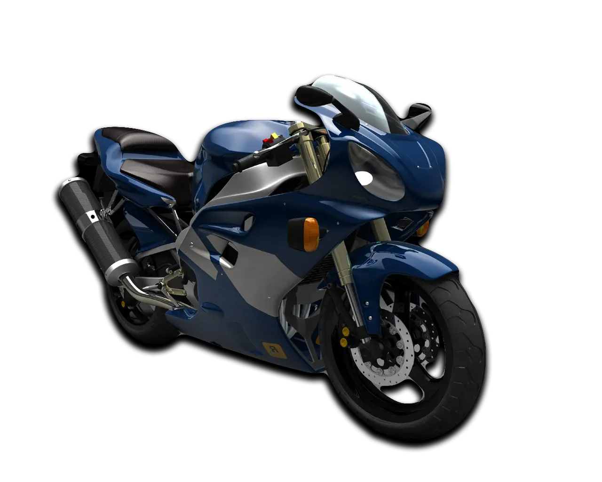
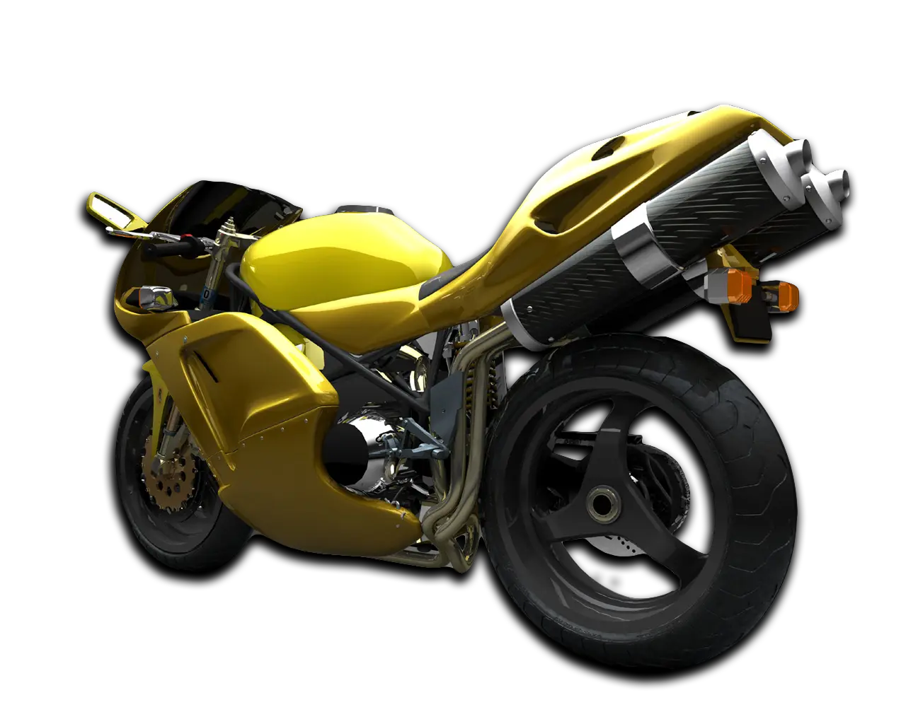

!!! note
    Updated Classic DOESN'T require original game or Steam. You can install a build and play Updated Classic without Steam.

    We have a build versioning that helps track changes and allows end users to determine how up to date their version is.. 
    
    Right now, ^^Build 2^^ is available for **Midnight Club II**.

You can download here : [Mega](https://mega.nz/file/D5YShK4a#sfpEJFcxNWJEh7RT1dmH8R4wT2aAcua5jnSWjNoMlKU) / [Google Drive](https://drive.google.com/file/d/1PJJPUDWM0pnyXqfYcfxJPz5r8KMkVTD4/edit) (Size: 1.3 GB)

## Install
Build works perfectly without Steam. But, if you want to play it through Steam, then follow the instructions below.    

So, you downloaded the archive and do not know what to do next.

1. **Remove the Steam Version:**  
    First, you need to remove all files from the original Steam version of the game. 

    To do this, click on the `Midnight Club II` with the right mouse button in your `Steam library` and select `Properties` > `Local Files`> > `Browse Local Files`.... After this action you will have to open the folder with the game files. Just delete them all.

2. **Installing Normal Version of the game:**  
Now everything is simple. All you have to do is unpack downloaded build archive, take all the files from it's root directory and move it to your steam-version folder (which must be empty). When you move (or copy) all these files, you'll be ready to play.

!!! note
    If you want to install the build without downloading the Steam version of the game, you can simply use the {++.acf++} file from the archive below, which is responsible for having the installed game on Steam.
Download:
[Mega](https://mega.nz/file/T94BRAAY#l3QVv-L9fFLpylARa99b8qxfCezOXhX65IJaeK1dmdg) / [Google Drive](https://drive.google.com/file/d/1zvAzj9Q1bnq5mZD1e_hqLb3EMoXxdxHy/edit)

Put file in `Steam\steamapps` folder, after installation, restart Steam.
Content of the archive:

- `appmanifest_12160.acf` - File for **Midnight Club II**

{ width="500" }

## Pre-launch

Recommendations before start the game:

1. **Prerequisites**
    
    Download and install all prerequisites from archive below. This is require to correct work of the game and mods.

    [Mega](https://mega.nz/file/T8pBxYoK#BlVBTUS4pJ5sTJogL9Reh82P9YI3UIi09m4iy31l0jg) / [Google Drive](https://drive.google.com/file/d/1OsDwUL2NI4cOGCChPR0gnyFOoa71l2Ea/)
    
    - DirectX Pack - `Prerequisites/Direct X/DXSETUP.exe`
    - Runtime Pack - `Prerequisites/Runtime Pack/RuntimePack_x86_x64.exe`
    - Visual C++ Redistributable Hybrid:
        - For x32 systems - `Prerequisites/Visual C++ Redistributable Hybrid/x32/VCRHyb86.exe`
        - For x64 systems - `Prerequisites/Visual C++ Redistributable Hybrid/x64/VCRHyb64.exe`

2. **Windowed Mode**
    
    To play with `Windowed Mode` open file `Midnight Club II/d3d9.ini` via notepad and change the values of parameters: `ForceWindowedMode` to `1`, `ForceWindowStyle` to `1`, `2` or `3`

        1 = borderless fullscreen
        2 = windowed
        3 = resizable windowed

{ width="500" }