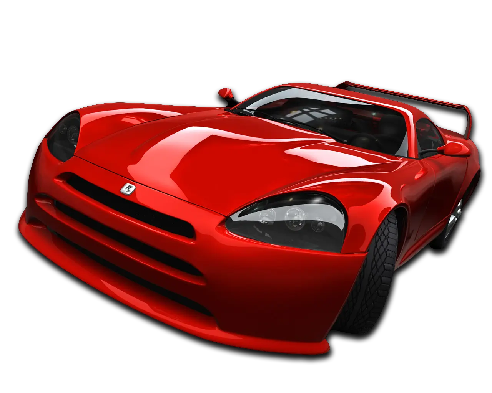
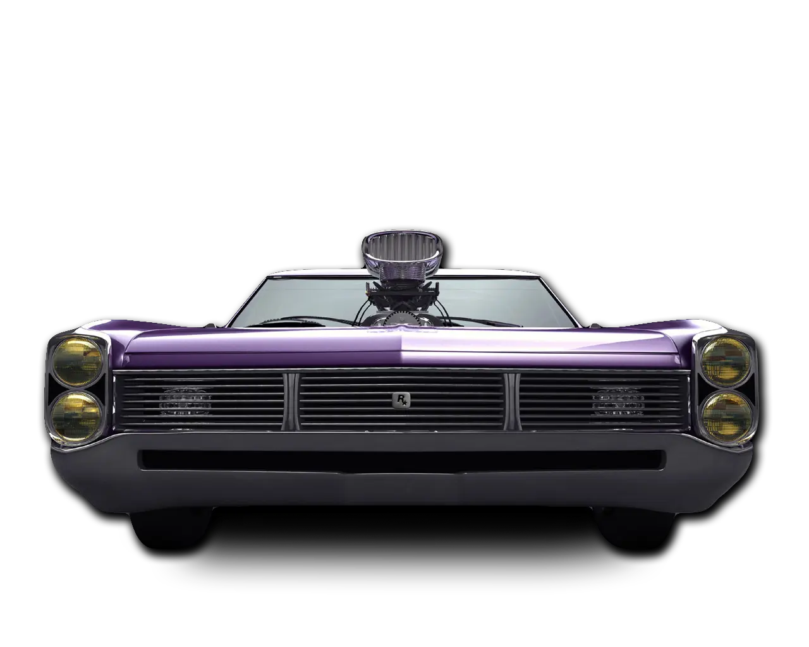

# Features

{ width="500" }

## Differences from default PC version

- The game are now works properly on Windows Vista and newer.
- The game is now locked on 30 FPS which leads to following changes:
    - Acceleration with Burnout are now more powerful which means:
        1. Car damage level is now increasing at slower rate;
        2. Amount of speed gaining from charging the Burnout is increased;
    - Acceleration without Burnout is now giving less start speed;
    - Allowed max speed of cars and how fast you can reach it are increased;
- Restored cut/unused traffic cars from both PS2 and PC versions (added as a new vehicles):
    - va_semitruck_l
    - va_trashtruck_p
    - va_cargotruck_small01_t
    - va_accord_t
    - [Exclusive] vp_mitsuclassc (from Midnight Club: Street Racing)
- Many difficulty and realism related changes:
    - Breaks are no longer works the same way as handbrake;
    - Edited some cars' oversteer to achieve more natural drifting and easy control of the vehicle;
    - Changed the speed of the wheels turn to simulate a little delay in movement and give a cars a sense of weight;
    - Mid and high-end vehicles now have the same landing damping value as a supercars;
    - Increased the speed sensitive steering for bikes which makes them turn more sharply as speed increases;
    - Some non-avoided scripted obstructions was removed in some enough hard races;
    - Reduced the amount of traffic in some races keeping them challenging instead of next to impossible;
- Roads textures are changed to PS2 ones which have a better quality.
- Added animation for water in fountains from Midnight Club 3.
- Added official Manual (located in ReadMe folder).

## Changelog

??? note "2023.12.24 - Build 2"

    - Restored some songs that were intended to be unlocked after beating the respective antagonists (Hector/Diego and Savo).
    - Enhanced street lights' effects.
    - Added option to play in borderless fullscreen, windowed or resizable windowed mode in d3d9.ini file.

{ width="500" }
