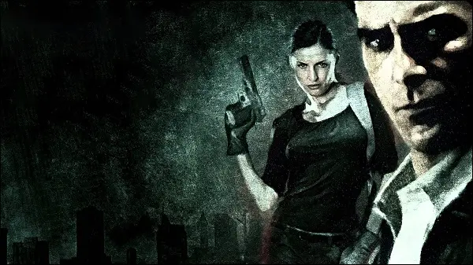

# Features

{ aligh=right width="500" }

## Changes - Part 1

**Differences from default PC version:**

- Game now properly supports any widescreen modes (16:9, 16:10, 21:9 etc.).
- Fixed problems with startup and initializing Direct3D by the game engine inside DllMain.
- Added all official ReadMes (located in 'ReadMe' folder).
- Added official PC Manual (located in 'ReadMe' folder).
- Added official Strategy Guide (located in 'ReadMe' folder).
- Shootdodging now really doesn't require any Bullet Time at all, the threshold/requirement value is now set to 0% (it's normally set to 0.01%).
- Fixed a difficulty level bug where you would get awkward amounts of ammo when playing on the "Detective" difficulty level.
- Fixed "Dead Man Walking", "Jump to Chapter" and "New York Minute" modes' shoddy level initializations, now all levels are loaded the same way the game starts a new game.
- All HUD elements on the bottom-left side are now spacious and the remaining ammo text has been slightly repositioned, they no longer look like they're "morphed" into each other.
- Corrected all of the HUD, graphic novel and menu sounds, now the way they are played matches MP1.
- Fixed the "Coder" console command, infinite painkillers are now properly given.
- Completely fixed and heavily improved almost each and every developer console command.
- Fixed a dialogue trigger left disabled in "Out of the Window", Mona now correctly speaks three dialogues instead of one when reaching the balcony near the condemned building.
- Sounds and ambient tracks are all now perfectly audible, some sounds weren't even audible in the original game! Prepare for the best sound experience ever.
- Corrected the ammo issues of weapon and ammo-box pickups:
    - Picking up a Striker ammo-box now gives 10 bullets instead of 20.
    - Picking up a Striker now gives 5 bullets instead of 15.
    - Picking up a Sawed-Off Shotgun now gives 2 bullets instead of 4.
    - Picking up an Ingram now gives 30 bullets instead of 45.
- Fixed the voice events of Vlad's arm-in-cast model variation, they are now correctly the ones used by Vlad's normal model variation.
- Fixed the second nightmare level's skybox, it previously didn't exist, now it's the one used in "There Are No Happy Endings".
- Restored the unused exclamation mark sign which appears when looking at points of interest, complete with proper position and size ala MP1.
- The "GetBeretta", "GetDesertEagle" and "GetIngram" console commands no longer give you the dual versions of the weapons, now you only get the single ones.
- Restored the "tip" sound from MP1, the sound file is in the game with probably higher quality but it went unused.
- The Grenade "weapon" is now given as well at the beginning of "Love Hurts".
(The game normally gives you the "ammo" for Grenades, but doesn't give you the "weapon" Grenade)
- Added twelve new commands for the developer console.
- Sound effects now take 23 seconds to fade after the player dies.
- Bullet Time reload cams are now skippable.
- Cinematics are now instantly skippable, keep any key held down while a level is loading to instantly skip the cutscene before even a single frame is rendered.
- Added simulated voice events to Max and Mona, the damage sounds are in the game but they all went unused.
- Rifles, ammo-boxes and painkillers now have separate pickup sounds (ported from MP1).
- Added a new, separate Bullet Time bonus for killing boss enemies (it is only 0.05 higher than the bonus given for killing commandos).
- Added one new Grenade explosion sound (ported from MP1), now there are four of them in total.
- Pool balls are now as physically dense as hard plastic, not as dense as glass.
- Heavily improved many motion-capture cutscenes by adding new code and uncommenting some special lines of code that were written but went unused.
- Added one new Molotov explosion sound (ported from MP1), now there are three of them in total.
- All AI-controlled Max and Mona models are now no longer shoddy recreations of their playable variants, they are now significantly improved in the terms of:
    - Behavior (unique and better AI behavior in combat, they all now use the same behaviour as the one used by the AI-controlled Max in "Out of the Window")
    - Animations (all of the ones normally used by the playable models, including the shooting animations)
    - Pixel-shading (they're now properly pixel-shaded just like the playable models. Normally, these models are partially pixel-shaded)
- Painkiller bottles now sound like they're made out of metal and you can even hear the pills rattle inside them now.
- Grenade pickups now have a proper collision sound (ported from MP1).
- Molotov pickups now have a proper "glass bottle" collision sound.
- Restored a special Sniper Rifle bulletcam triggered when you shoot an enemy while in scope mode with maximum Bullet Time efficiency, this is in the game but it went unused.
- Jump to Chapter now gives you all of the weapons that were possible to collect in the level before the one you selected to play.
- Mona's weapons from "The Genius of the Hole" now carry over to "A Losing Game".
- Vlad's left arm is now 0.75 more vulnerable than usual during the boss fight in "That Old Familiar Feeling", it's strange how his arm was suddenly completely healed.
- Killing Bravura and Winterson in "The Depths of My Brain" now gives you the new "boss" Bullet Time bonus.
- "The Depths of My Brain" also uses the skybox from "There Are No Happy Endings" now.
- Vinnie Gognitti's costume now has dynamic shadows, normally the skin is set to use a single static shadow.
- Bullets are now clearly visible during gunfights and when you pause the game, so now you can avoid damage by dodging them.
- Fixed a bug where the player was only given a Beretta when starting some levels using Jump to Chapter.
- Uncommented two lines of code that make the player to be invulnerable when Shootdodging, just like in MP1.
- Mona now has a Desert Eagle in the initial cutscene of "Love Hurts" and switches to the Dragunov after the cutscene, this is because she holds the Dragunov with one hand.
- Fixed all of the incorrections in the player shoot animations' code, now all weapons are fired correctly at their correct timings and with their intended muzzleflashes.
- The subtitles now appear at the bottom of the screen.
- All Mona skins now use a more "girly" standing animation when wielding one-handed weapons, and the animation actually fits her.
- All "Dead Man Walking" levels now use the correct skyboxes that were used in the levels' storyline versions.
- Changed all Manor levels' sky color to dark-blue to match the pre-release screenshots used as the survillence camera screens in "Love Hurts".
- Fixed all Mona skins' heads, the bullets no longer pass through them.
- Added an indoors ambient track to "On a Crash Course".
- Max now looks wounded in the second nightmare level, this was done to match the graphic novel cutscene.
- Soft thunderclaps may now be heard among the loud ones.
- The Sawed-Off Shotgun's collision sound is now correctly the one used for small weapons, it previously used the "large weapon" collision sound.
- All ammo-box pickups now use the "small weapon pickup" collision sound. Previously, they didn't have any collision sounds.
- The female doctors now wear surgical masks during "Bravura's operation" security camera cutscene in "Too Stubborn to Die", the masks are in the game but they went unused.
- The skyboxes of "A Criminal Mastermind" and "On a Crash Course" now use the horizon texture of the skybox used in "A Mob War" since these levels take place in the Bronx.
- The sky is now stormy black in "Too Stubborn to Die", "On a Crash Course" and "A Losing Game".

## Changes - Part 2

- The "dream" skybox's dark-blue sky texture now the same as the other dark-blue sky texture used for other skyboxes.
- The Grenade and Molotov throwing animations of AI-controlled characters now work the same way as the player's throwing animations.
- Removed screen darkening when the player dies.
- Max now keeps an eye on Mona during "Love Hurts" and Mona's health meter also appears on the HUD, but it doesn't fill because Mona is coded to be invulnerable in that level.
- Restored an unused collision sound variation for the pool balls.
- Kaufman's head damage multiplier is now internally separate, instead of being under the "Torso" damage multiplier section.
- Fixed the two-handed run and walk animations for all male and female AI characters, they no longer use the one-handed ones when running or walking in some directions.
- Any thrown Grenades now leave a small mark on whatever they collide with, just like when using the Melee attack.
- The dynamite sticks Vlad throws at Max in "That Old Familiar Feeling" now also leave a small mark on whatever they collide with.
- The player death music from MP1 now plays if the player dies while playing as Mona (the music track is in the game but it went unused).
- Fixed the Sniper Rifle and Ingram ammo clips' collision sounds, the rifle clip sound was being used for Ingram and the handgun clip sound was being used for Sniper Rifle.
- All Max skins are now selectable with the "-developerkeys" command line.
- Fixed the "static" Beretta sliders, they move properly now.
- Any thrown Molotovs now cause five fiery pieces of glass fragments to fly out with randomized direction and rotation upon explosion (ported from MP1).
- Molotov explosions now leave behind a unique decal (ported from MP1).
- All weapons now use one model for both far and near distances, which no longer causes the weapon animations to not display when the camera is far away.
- Weapons in both hands now perform their reloading animations when reloading in Bullet Time.
- Added a new weapon: Vlad's Desert Eagle, a unique new weapon that Vlad now uses in all of his appearances:
    - It's completely the same as the actual Desert Eagle. Except that it uses it's own ammunition supply, animations, sounds and statistics.
    - The maximum amount of ammunition that can be carried for the gun is eleven bullets. Ten bullets in the clip and one bullet as spare ammo (to allow proper reloading).
    - It uses the Sawed-Off Shotgun's shooting animation and the Beretta's reloading animation, because it's looks cooler when used with one hand.
    - It uses unique shooting and reloading sound effects (ported from MP1).
    - To avoid any difficulty level-breaking issues, the gun's statistics are the same as the actual Desert Eagle.
    - It becomes available to Max in "That Old Familiar Feeling", and it's only available in that level.
    - It appears on the top of the Secondary Attacks slot when it is available (but it is a primary weapon).
    - The gun cannot be dual-wielded at all, even if two pickups of the gun are somehow spawned.
    - Max can still carry the actual Desert Eagle separately.
    - It's not selectable as a "Best Weapon" because it's a special weapon (and it's statistics are the same as the actual Desert Eagle anyway).
    - A proper "GetDesertEagleVlad" console command is added.
    - The weapon works properly with the "Coder", "GetAllWeapons" and "GetInfiniteAmmo" console commands.
- Removed the unrealistic "burst-firing" from the Ingram and Dual Ingrams, now they fire single shots on each press of the Shoot button.
- Removed the "combined" shooting sound of Dual Ingrams, now each gun plays it's own sound.
- Corrected the timings of weapon animations when using Dual Berettas, Dual Desert Eagles or Dual Ingrams.
- Restored the unused chamber sound for the Sniper Rifle.
- Changed the color of weapon icon textures to be grey-scaled so any color can be applied on them.
- Weapon icons are now displayed instead of weapon names, like in the PS2 versions of the game.
- Removed weapon slot numbers from the HUD, because the Secondary Attacks' slot number's color differs from other slot numbers' color and it cannot be changed.
- Changed the color of Bullet Time Tone Remapping effect texture to be grey-scaled so any color can be applied on it.
- Changed the miscellaneous values for the female animation skeleton to be the same as the male animation skeleton.
- Uncommented one line of code that triggers one of Max's serious face expressions in Max's animation code in the first level's initial cutscene.
- The "hospital_ambience" ambient track now plays instead of "rain_indoors" during the cutscene where Max finds the dead security guard.
- Removed excessive ammo from the Beretta given after Max picks it up from the dead security guard.
- Uncommented two lines of "change motion blur" in the cutscene where the commando shoots Jim Bravura.
- Uncommented two coupled lines of "fade-to-and-from-black" in the same cutscene.
- Uncommented three lines of the cinematic "SLAM!" sound effect in the same cutscene.
- Corrected the outside ambient track in "Elevator Doors", now "rain_medium" is used instead of "rain_heavy".
(Normally, if you enter the warehouse and then exit it, the game starts playing "rain_medium" instead of "rain_heavy".)
- Replaced all characters' "simulated shooting" commands with the proper weapon animation-playing commands from their non-cutscene shooting animations.
("Simulated shooting" means the animation will only play the particle effect, sound effect and create the bullet projectile. But the weapon won't be animated.)
- The "rain_medium" ambient track now plays during initial cutscene of "A Criminal Mastermind" and later changes into the indoors ambient track when Max gets into the building.
(The outside ambient track was missing previously.)
- Uncommented tons of lines related to face expressions and shooting sound effects in Vinnie Gognitti's introduction cutscene animation's code in the same level.
- Uncommented ten more face expression lines in the code of Vinnie's cutscene animation of the level's ending cutscene.
- Fixed a missing Desert Eagle bullet when Vlad fires the last bullet in his introduction cutscene.
- Fixed missing Ingram muzzleflashes in Vinnie's introduction cutscene.
- Fixed three missing Ingram bullets in Vinnie's introduction cutscene.
- The indoors ambient track now plays in the ending cutscene of "A Criminal Mastermind" because the "combat" music track gets annoying afterwards.
- Fixed missing fades at the end of the initial cutscenes of "The Depths of My Brain" and "No 'Us' in This".
- Max no longer wields a Beretta in the cutscene where Bravura and Winterson are interrogating him in "The Depths of My Brain".
- Max and Mona now no longer wear their headsets in the ending cutscenes of "The Million Dollar Question" and "The Genius of the Hole" as they're not needed anymore.
- Max now drops his gun in the ending cutscene of "The Million Dollar Question" as his open hands in the cutscene's animation clearly suggest.
- Fixed missing bullets when Max and the cleaners shoot at each other in the initial cutscene of "The Things That I Want".
- The "landing dustcloud" particle effect now plays when Max lands on the ground in the initial cutscene of "The Things That I Want" (the effect plays, but it's off-screen).
- Uncommented several lines of "simulated shooting" in Max's animation code in the ending cutscene of the same level, and thus, Max now shoots at the van.
- Also fixed the missing bullets when Max shoots at the van.
- The "landing dustcloud" particle effect now plays when Max lands into the back of the van in the same cutscene.

## Changes - Part 3

- Again, fixed the missing bullet when Max shoots the cleaner in the initial cutscene of "In the Middle of Something".
- Nicely optimized the initial cutscene of "Blowing Up":
    - Max now grunts when the ammoboxes explode and send him flying.
    - Max grunts again when he lands on the floor.
    - A proper "landing dustcloud" particle effect now plays when Max hits the floor.
- Uncommented two lines that make music and sound effects fade to complete silence in Max's animation code in the same level's ending cutscene.
- The "landing dustcloud" particle effect now plays when Max hits the ground in the same cutscene.
- The AI-controlled Max no longer wields a Beretta when jumping from the window in "Out of the Window".
- The AI-controlled Max's animation in the same level also has a proper "landing dustcloud" particle effect when he hits the ground now.
- Fixed missing fade at the end of the initial cutscene of the second nightmare level.
- The "landing dustcloud" particle effect now plays when Max lands on the ground in the ending cutscene of "A Mob War".
- Uncommented three lines and corrected two lines in Vlad's animation code in the initial cutscene of "There Are No Happy Endings":
    - The Desert Eagle shoot sound effect and particle effect now plays when Vlad fires the gun, the commented code was set to play the Beretta sound so I changed it to Desert Eagle.
    - Cinematic sounds now play in the background when Vlad shoots Max and slightly before the fade to white after Max is shot.
    - The screen fades out from red when fading out to the dreamscape after the screen fades to white, according to a developer's comment left in the code.
- Also fixed Max's eyes in the same cutscene, they're now closed properly.
- Disabled Max's eye-blinking in the same cutscene.
- The "landing dustcloud" particle effect now plays when Max lands on the floor in the same cutscene.
- Replaced Max's static "lying dead" animation in "A Losing Game" with Max's initial cutscene animation from "There Are No Happy Endings" for consistency.
- Max now correctly has a Beretta in his inventory at the beginning of "Love Hurts" as the initial cutscene clearly shows.
- Max holds the Beretta with his left hand when helping Mona climb over and later shifts it to his right hand while he's offscreen.
- The "landing dustcloud" particle effect now plays when Max lands on the floor in the same cutscene.
- The bald bodyguard Mona sneaks up to and kills in the same level now wields a handgun as his right hand's animation suggests, and gave him a Desert Eagle to wield.
- Mona now fires only one bullet instead of two when shooting the bodyguard in the same cutscene.
- "Rain_heavy_windy" ambient track now plays in the ending cutscene of the same level and later changes into the player death music when Max realizes who Mona is working for.
- Heavily improved the initial cutscene of "That Old Familiar Feeling":
    - The unused "city_rainy" ambient track now plays in the background, which sounds a lot like the one heard in the ending graphic novel cutscene of "Love Hurts".
    - A small blood stain can be seen on the floor near the stairs, this was done because that's where Max is hit in the back of his head by Mona in the graphic novel cutscene.
    - All of Max's weapons can be seen lying on the floor behind Max, but they don't depend on what you collect in the previous level though.
    - Mona's Desert Eagle, which she dropped in the graphic novel cutscene, can be seen lying on the floor.
    - Another blood stain can be seen on the floor near Mona's corpse.
    - A Desert Eagle shell can be seen lying on the floor near Vlad, but it's off-screen.
    - Fixed incorrect timing of Max's serious face expression, the expression now appears when the camera cuts to his face, not a second before the camera cuts back to Vlad.
    - Fixed Mona and Woden's eyes, they're now closed properly and they don't blink them anymore.
    - Woden's angry face expression now lasts until the part where he is shot.
    - Fixed Woden's mouth, it no longer stays stuck moving hysterically after he dies.
    - Max and Vlad scream when the bomb explodes and they fall, they also grunt after landing in the cellar.
    - The ambient track changes into the "rain_indoors" one when the camera cuts to the cellar.
    - Vlad now grabs his left arm (while grunting) after getting up and kicking Max, giving the player a hint about his weak point.
    - The sub-animation that used for this feature is in the game but it went unused, but it wasn't meant to be used here.
    - The "Max's Duty Corrupted" music track now plays when Max about to pick up the Desert Eagle.
    - And of course, Vlad's special Desert Eagle becomes available to the player, but with seven bullets only because Vlad shot Mona once and shot Woden twice.
- The unused "warehouse_inside_rain" ambient track now plays instead of plain silence in the ending cutscene of "That Old Familiar Feeling".
- Added an MP5, MP5 ammo-box and a painkiller bottle in the back of the van Max jumps into in the ending cutscene of "The Things that I Want" to match the next level.
- Added the following pickups to "In the Middle of Something":
    - 3 Dragunovs and 2 Dragunov ammo-boxes in the room above the one full of ammunition where Max says "Close to overkill. Hardcore professionals".
    - 2 Dragunovs and 3 Dragunov ammo-boxes in the second room on the fourth floor with two Sniper Rifle ammo-boxes.
    Added the following pickups to "Out of the Window":
    - A Beretta ammo-box and a Kalashnikov ammo-box on a wooden palette outside the room you start the level.
    - A Desert Eagle ammo-box and an M4 Carbine ammo-box on a second wooden palette next to the one with the Beretta ammo-box.
    - An Ingram ammo-box on a third wooden palette near the balcony with a view of the explosion in the condemned building.
    - A Sawed-Off Shotgun and a Shotgun ammo-box on a big crate near the third wooden palette.
    - A Sniper Rifle and 6 Sniper Rifle ammo-boxes on the balcony where Mona sees Max jump from the window.
- The pickups that appear on the balcony near the condemned building in "Out of the Window" are now visible in "Blowing Up" as well, but they can't be reached.
- Conversely, a dead cleaner's Beretta can be seen lying on the fifth floor of the condemned building in "Out of the Window".
- Added a Dragunov and a Dragunov ammo-box in the apartment with the mobster who is afraid of heights in "A Mob War".
- Added a Striker, 4 Striker ammo-boxes and a Sniper Rifle in the room leading to the electricity control room of the funhouse in "A Losing Game".
- Added a Sawed-Off Shotgun, a Dragunov and a Dragunov ammo-box on the sofa in the middle entrance hall of Woden's manor in "Love Hurts".
- Added 3 Berettas inside the cellar room Max falls into in "That Old Familiar Feeling".

## Changelog

??? note "2021.03.09 - Build 2"

    - Changed weapon HUD positions to match PS2 version.

??? note "202X.00.00 - Build 3"

??? note "2023.10.09 - Build 4"
    - Added DSOAL, a better alternative to fix sound issues and also adds 3D sound to the game.

??? note "2023.12.26 - Build 5"
    - Fixed a problem where Pooh would get stuck on the balcony in the "My Dear Friend" chapter (FPS locked at 60).
    - Fixed other potential minor issues caused by high FPS.
    - Size of black bars in cutscenes now depends on aspect ratio.
    - Added option to d3d9.ini file to play in windowed mode without frames, in window, and in scaled window.

??? note "2024.03.17 - Build 6"
