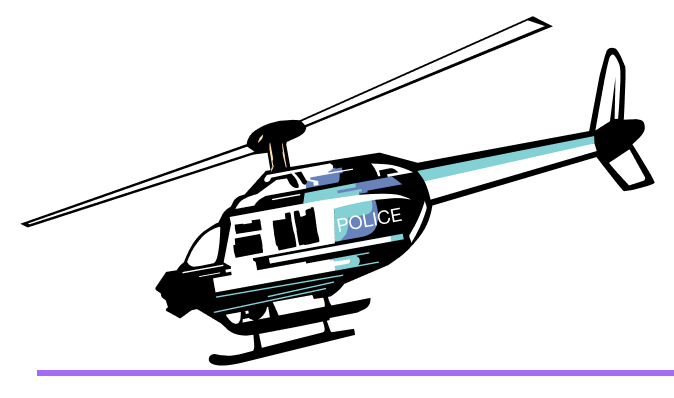

# Grand Theft Auto 3




## Differences from the PC version 

{ align=left width="300" }

- Vehicles.
- Icons of weapons and radar.
- Setting of the weather.
- The colors of the vehicles.
- Reflections on the vehicles.
- Effects: Fire, rain, smoke and water spray.
- Load screens (replacing each other, instead of one static one on the PC).
- Radio station Double Clef FM (with the restored song "O mio babbino caro").
- Better sound quality.
- Glows under pickups.
- Headlights now work correctly.
- Police radio dispatch voice sound.
- Camera when getting in car.
- Color correction.
Many of the above can be seen in the [Demonstration](#demonstration) section. 

### Fixes

- The mouse no longer goes beyond the screen, which makes it easy to play on multiple monitors.
- A more accurate frame count per second, removing lags when the frame limiter is on.
- The game will not ask for a CD when all the audio files are copied to the disc.
- The cheat code for armor is now "TORTOISE" - as in version 1.1.
- The "BOOOOORING" bitcode is now working correctly - as in version 1.1.
- Mouse sensitivity now works correctly - as in version 1.1.
- The problem with Purple Nines disappear has been fixed.
- The game now works a little better with a high FPS. However, there are still problems with the physics of cars, gravity and sounds.
- Rhino, the generated with cheat-code no longer remained on the map forever.
- Blista is now accepted by a crane on scrap metal. However, now the Coach is not accepted there.
- When firing from the M16 from the first person is now correctly counted the number of bullets.
- Reflections on wet roads have been corrected.
- The text relating to garages and rampages is now correctly scaled by screen resolution.
- All text now has the correct shadows (depending on the selected resolution).
- The mouse sensitivity on the Y axis is now synchronized with X.
- The interface now has the correct size relative to the screen resolution.
- Added full support for gamepads.
- Added mip-map levels for all textures.
- The police helicopter now has a shadow.
- Various fixes on the map.
- In the folder "ReadMe" you can find the manual for the game.
- A bug with black vehicles has been fixed.
- Many vehicles fixes.
- First cut-scene now have an English subtitles for news messages.
- Game now can use up to 4 GB RAM.
- Fixed aiming with flamethrower.
- (Exclusive) Fixed all scrollbars.
- Now Claude siting in boat.
- Disabled Stunt-camera for Dodo.
- (Exclusive) Big textures research. Many textures was replaced with their better analogs (not HD).
- Added HD icon for the game (can be found in the Icons folder).
- Users with Creative SoundBlaster cards now could select EAX, EAX 3.0, A3D and DirectSoundHW modes by using Creative ALchemy.

Much is also in the "[Updates](#updates)" section.


## Demonstration 


Few samples, and create spoiler for more images?

### Some of our exclusives

IMAGES ---------------

And also a videos representing the differences between PS2 and PC versions (not all) by Vadim M:

VIDEOS ---------------


## Download Build 


!!! note
    Updated Classic DOESN'T require original game or Steam. You can install a build and play Updated Classic without Steam.
{--We are marks versions of this pack--}, so that it's easier to navigate with the freshness of the versions. Right now, ^^Build 29^^ is available for Grand Theft Auto III.

You can download here : [Mega](https://mega.nz/file/LpAXzL7A#0Fkx-YtC-tmJuin8_F2Lw1yZihuu_jkTS2EeXk9keAA) / [Google Drive](https://drive.google.com/file/d/19d5hf1e9GIFHc9q8NFXiI_HLQ4H3IvL0) (Size: 1.05 GB)

### Install
Build works perfectly without Steam. But, if you want to play it through Steam, then follow the instructions below.    

So, you downloaded the archive and do not know what to do next.

1. **Remove the Steam Version:**  
First, you need to remove all files from the original Steam version of the game. To do this, click on the Grand Theft Auto III with the right mouse button in your Steam library and select Properties > Local Files> > Browse Local Files.... After this action you will have to open the folder with the game files. Just delete them all.

2. **Installing Normal Version of the game:**  
Now everything is simple. All you have to do is unpack UC GTA III Build 29 archive, take all the files from it's root directory and move it to your steam-version folder (which must be empty). When you move (or copy) all these files, you'll be ready to play.

3. **Install all necessary components for the game from the folder ReadMe/Prerequisites.**  
This is require for correct work of the game and mods. You may think, that it's not really necessary installing these libraries, but it can give a guarantee, that you won't see an error like "Can't find file.dll". We truly recommend to install it because it's useful not only for this build, but for any other games.

    - DirectX Pack - ReadMe/Prerequisites/Direct X/DXSETUP.exe
    - Runtime Pack - ReadMe/Prerequisites/Runtime Pack/RuntimePack_x86_x64.exe
    - Visual C++ Redistributable Hybrid - ReadMe/Prerequisites/Visual C++ Redistributable Hybrid/VCR_Hyb_x86_x64_24.04.2019.exe

!!! note
    If you want to install the build without downloading the Steam version of the game, you can simply use the {++.acf++} file from the archive below, which is responsible for having the installed game on Steam.
Download:
[Yandex.disk](https://yadi.sk/d/cmUtWcZrMXOWWg) / [Google Drive](https://drive.google.com/file/d/1PIGmoXOuI6EXkFPmktnnszwqQ_oGxwY7)

Put file in Steam\steamapps folder, after installation, restart Steam.
Content of the archive:

- appmanifest_12100.acf - File for Grand Theft Auto III
- appmanifest_12110.acf - File for Grand Theft Auto: Vice City
- appmanifest_12120.acf - File for Grand Theft Auto: San Andreas


## Pre-launch 


Recommendations before start the game:

1. **Turn on Frame Limiter in game display settings.**
This is necessary for the game to work correctly. Since the game was not designed for high FPS, all sorts of problems appear because of it: some missions do not load, physics breaks.
Rockstar's official ReadMe also contains this recommendation.

2. **Make sure, that you have installed all necessary components for the game.**
If you're not sure about this, you certainly need to visit Readme/Prerequisites and install:
    1. DirectX Pack - ReadMe/Prerequisites/Direct X/DXSETUP.exe
    2. Runtime Pack - ReadMe/Prerequisites/Runtime Pack/RuntimePack_x86_x64.exe
    3. Visual C++ Redistributable Hybrid - ReadMe/Prerequisites/Visual C++ Redistributable Hybrid/VCR_Hyb_x86_x64_24.04.2019.exe

3. Set the value of anisotropic filtering in the settings of your video card to the maximum value available.
This is to make the textures look as good as possible. Without anisotropic filtering, textures (mostly roads) will be blurry at close range.

If you have any technical problems/questions, see the "Frequently Asked Questions" section.

!!! tip "If you have problems with the build" 
    Contact with us on our Discord server ("🔨｜support" channel). If the build has crashed, please attach these files to your report message

     - Grand Theft Auto 3/modloader/modloader.log.
     - Grand Theft Auto 3/mss/scrlog.log.
     - Grand Theft Auto 3/cleo.log.
     - Grand Theft Auto 3/scripts/ucic.log.

## Updates 


In this section you can see a list of changes in latest versions of build.

### ^^Installing updates^^
With each update, we completely re-upload the build. So, to install the update, you need to download the new Updated Classic build and unpack it into a clean folder.
Never install the update over the previous build!

### ^^Changes^^

??? note "2020.04.21 - Build 27"
    - Minor textures and collision fixes.

??? note "2021.09.30 - Build 28"
    - Intro clips replaced with PS2 version.
    - Fixed an issue where you couldn't deal damage with bat and flamethrower after    ~15 minutes of play.
    - In 'Under Surveillance' mission, cutscene and text are in sync with the meaning      of the mission.
    - The 'Gesundheit' cheat now fixes the appearance of vehicles.
    - Huge number of improved and corrected collisions.
    - Belleville Park's lake are now has reflections.
    - Fixed Ghost.
    - Fixed the wall at the Panlantic construction site.
    - ==[Exclusive]== Fixed font in stats as in version 1.01.
    - Airtrain, Deaddodo and Chopper now have collision.
    - Leon Macaffrey now has a unique model with the head from LCS.
    - ==[Exclusive]== Pedestrian male01 has the phrase "I Designed PS2" back from the PS2      version.
    - ==[Exclusive]== Restored 3 cut parked cars.
    - ==[Exclusive]== Added Claude's sole texture.
    - ==[Exclusive]== Added headlights and chrome bumper to BF Injection.
    - ==[Exclusive]== Fixed Asuka's whip in the 'Grand Theft Aero' cutscene.
    - ==[Exclusive]== Police code 48 (speeding) is no longer played.
    - Deaddodo tracks are replaced with original ones.
    - ==[Exclusive]== Unique police conversations in missions are taken from PS2.
    - Claude's running animation is replaced with the PC version.
    - Dodo's model is fixed.
    - ==[Exclusive]== Fixed missing number 2 on one of the garage doors in Portland.
    - ==[Exclusive]== Quadruple Instase Stunt Bouns is now can be achieved.
    - ==[Exclusive]== 'Bling-Bling Scramble' and 'Plaster Blaster' missions now have 3     paths, like on PS2.
    - Shoreside save house now has all 3 garage doors opens.
    - Fixed an issue where the 'Radio Head' station would pop up when entering a   service vehicle.
    - Fixed problem with FBI Car colors.
    - ==[Exclusive]== Claude is no longer visible in some locations during the credits.
    - ==[Exclusive]== Various corrections to the text (English).
    - ==[Exclusive]== Fixed Claude's double appearance in the 'Last Requests' mission      cutscene.
    - ==[Exclusive]== Securicar in 'Escort Service' and 'Decoy' missions now has correct   colors.
    - ==[Exclusive]== Numerous models and textures fixes.
    - ==[Exclusive]== Fixed an issue where the radar map was going off the radar circle.
    - ==[Exclusive]== Various map fixes.
    - ==[Exclusive]== Fixed marker height in 'Uzi Rider' mission.
    - Fixed the destruction of lamposts.
    - ==[Exclusive]== Improved houses in Helburn Heights. They now have porches and night      lights, similar to Shoreside houses.
    - ==[Exclusive]== Fixed Claude in intro cutscene.   
    - HD Interface:
        - Weapon icons have been improved.
        - ==[Exclusive]== Fixed an issue where the radar map was going off the radar circle.

??? note "2022.12.30 - Build 29"
    - Most of addons (including new ones) are now built-in in game and can be turned on/off via modloader/modloader.ini file.
    - Built-it addons:
        - Breakable windshields for vehicles;
        - Burstable tyres for vehicles;
        - Ability to move camera around the player like in GTA San Andreas;
        - Destroyable airtrains;
        - Dynamic shadows for peds and vehicles;
        - Wanted level stars are no displayed when you don't have wanted level;
        - Ability to move camera around the vehicle like in GTA Liberty City Stories;
        - Remove zeroes in money HUD;
        - Claude animations from PC version;
        - Weapon and radar icons from PC version;
        - Weapon and radar icons from PC version (classic);
        - Improved draw distance for light sources (2dfx);
        - PS2 crosshair with PC weapon and radar icons;
        - PS2 crosshair with PC weapon and radar icons (classic);
        - PS2 crosshair with PS2 weapon and radar icons;
        - PS2 crosshair with PS2 weapon and radar icons (classic);
        - Russian language;
        - Russian language (classic);
        - Police stingers (use it only with burstable tyres addon);
        - Borderless windowed mode;
    - Donwloadable addons:
        - Classic interface;
        - EAX Alchemy Fix;

    - Yardie gang member are now have different skins.
    - Lampposts in Shoreside Vale are now destroyable.
    - [Exclusive] A lot of map fixes:
        - Fixed objects prelight;
        - Fixed missing and flipped textures;
        - Fixed UV-mapping;
        - Fixed incorrect objects positions (some of them was midair or under the   map);
        - More minor fixes;
    - Hands of Colombian gang members in 'The Exchange' cutscenes flipped on 180 degrees.
    - A lot of vehicles fixes.
    - (English) Fixed subtitles in "Bling-Bling Scramble", "UZI Rider", "Gangcar  Round-Up" and "Kingdom Come" missions.
    - Added big heads cheat code like in GTA Liberty City Stories. Combination - BOBBLEHEADS.
    - The entire interface are now in HD by default with some exclusive changes.
    - Fixed Catalina's neck.
    - Fixed some gang members skins.
    - [Exclusive] Added some details to Pike Creek from official unreleased multiplayer map.
    - [Exclusive] Big props converting from GTA Liberty City Stories:
        - Lighthouse;
        - Parking lot near SupaSave in Portland;
        - Rocks near dam in Shoreside Vale;
        - Trash can and trash bins;
        - Wires;
        - Fire ladders;
        - Drilling machines in Shoreside Vale tunnels;
        - Night lights in Portland;
        - Tourist booth near subway in Shoreside Vale;
        - Garage near Tony's safehouse in Shoreside Vale;
        - Minor props and improvements;
    - [Exclusive] A lot of new particles, light sources and details on the map:
        - Vents smoke and antenna lights on Head Radio building;
        - A lot of details behind Tony's restaurant: windows, fence, fire ladders,  lights   sources;
        - Airport runway lights;
        - Details + new light source on stadium in Staunton Island;
        - Portland docks;
        - Gas station and Easy Credit Autos in Portland;
        - Details on the mountain on north of the city;
        - Added LOD for Colombian mansion;
        - Added LOD for rocks in the water;
        - Garden bed for trees in the concrete;
        - Crossroad near Callahan bridge in Portland;
        - Improved Rockstar billboards;
        - Fixed geometry, textures, prelight and shadows in Belleville Park;
        - Details for Leon McAffrey's house;
        - Added flickering lights on the drawbridge between Staunton and Shoreside  Vale;
        - Minor small improvements and light sources;
    - [Exclusive] Pay'n'Spray, Ammu-Nation and 8-Ball garage are now display on   the   radar after completing certain missions;
    - Plugins has been updated;
    - Fixed issue with planes draw distance (by removing collision);
    - [Exclusive] Fixed platinum textures in 'Bullion Run' like in PS2 version.
    - [Exclusive] Now you will see 'Mission Complete' after completing 'The   Exchange'.
    - [Exclusive] Fixed one part of rail tracks in Portland.


## Addons 


In this section I suggest some interesting addons for your favorite game.
By default some of them already built-it and can be enabled via modloader/modloader.ini file.

**Just change value opposite needed addon on any digit above zero**
Examples:
!!! note "Enabling/Disabling addon (via modloader/modloader.ini)" 
    - Enabled
    ```(addon) breakable windshields = 100```
    - Disabled
    ```(addon) burstable tyres = 0```


1) Breakable windshields 
!!! note "" 
    `(addon) breakable windshields = 100`

2) Burstable tyres 
!!! note "" 
    `(addon) burstable tyres = 100`

3) Ability to move camera around the player like in GTA San Andreas
!!! note "" 
    `(addon) classic axis = 100`

4) Classic Interface (Original interface quality.)
!!! note "" 
    1. Download and unpack [[III] Classic Interface.zip](https://drive.google.com/file/d/1s7ux3IRG1zlAxrzyagu5nEhBgBMbF6_2) archive.
    2. Move content from ^^put in the game folder^^ folder to the game directory.
    3. `(dlc) classic interface = 100`

5) Destroyable airtrains
!!! note "" 
    `(addon) destroyable airtrain = 100`

6) Dynamic shadows
!!! note "" 
    `(addon) dynamic shadows = 100`

7) Hide wanted level like in GTA San Andreas
!!! note "" 
    `(addon) hide wanted level = 100`

8) No money zeros
!!! note "" 
    Removing zeros from money interface. For example, now you'll see "$350", instead of "$00000350".

    `(addon) no money zeros = 100`

9) Ability to move camera around the vehicle like in GTA Liberty City Stories
!!! note "" 
    `(addon) lcs vehicle camera = 100`

10) Claude animations from PC version
!!! note "" 
    `(addon) pc anims = 100`

11) PC radar and weapon icons
!!! note "" 
    `(addon) pc weapons and radar icons = 100`

    For 'Classic Interface' addon:

    `(addon) pc weapons and radar icons classic = 100`

12) Project 2DFX - Increase draw distance of light sources
!!! note "" 
    `(addon) project 2dfx = 100`

13) PS2 crosshair
!!! note "" 
    `(addon) ps2 crosshair ps2 weapons and radar icons = 100`

    For 'Classic Interface' addon:

    `(addon) ps2 crosshair ps2 weapons and radar icons classic = 100`

    For 'PC weapons and radar icons' addon:

    `(addon) ps2 crosshair pc weapons and radar icons = 100`

    For both 'Classic Interface' and 'PC weapons and radar icons' addons:

    `(addon) ps2 crosshair pc weapons and radar icons classic = 100`

14) Stingers

!!! note "" 
    `(addon) stingers = 100`

    ==Use this only with 'Burstable tyres' addon==
    

15) Borderless windowed mode
!!! note "" 
    `(addon) windowed mode = 100`

16) Ability to choose EAX, EAX 3.0, A3D and DirectSoundHW modes for users with Creative SoundBlaster sound card
!!! note "" 
    1. Download and unpack [[III] EAX Alchemy Fix.zip](https://drive.google.com/file/d/1WdgPJSgbSc5ed-H3Y0y-hz2KfK8A38pg) archive.
    2. Move content from put in the game folder folder to game directory.

## Frequently Asked Questions


In this section, you may be able to find answers to some questions related to the build (the list will be updated).

??? note "Can I install third-party modifications to the build?"
    Yes, but please note that this can cause various technical problems/issues and you will lose our support in these matters.

??? note "Which Windows versions are supported?"
    Windows 7 SP1, 8 and 10.

??? note "Will there be Liberty Unleashed or Multi Theft Auto support?"
    Not planned.

??? note "The game is very slow"
    1. In file Grand Theft Auto 3/scripts/GTA3.WidescreenFix.ini set for parameter **ForceMultisamplingLevel** value 0.
    2. Delete file Grand Theft Auto 3/mss/scrlog.asi.

    ==WARNING! If you'll complete a second step - there is will problems with support!==

??? note "When the game starts, the window with the message "AppId is not configured." comes out."
    Delete the file Grand Theft Auto 3/mss/GInputIII.asi.
    
    Note: After this, support for gamepad will be lost.

??? note "Game doesn't launch or black screen after launch / When resolution setting identical to the resolution of the monitor, the game freeze/crashes / Error: Cannot find "1x1x1" video mode."
    1. In properties of gta3.exe go to Compatibility, select Change high DPI settings and turn ON following parameters:
    "Program DPI: when I open this program"
    "High DPI scaling override: Application".
    2. In the file Grand Theft Auto 3/scripts/GTA3.WidescreenFix.ini in the parameters ResX and ResY set the resolution values of your monitor.
    Example:
        `ResX = 1920`
        `ResY = 1080`
    3. Install DirectPlay.
    4. Delete file My Documents/GTA3 User Files/gta3.set.
    5. Set the compatibility with Windows XP SP3 (for example).

??? note "Intro movies don't work."
    Set Compatibility with Windows XP Service Pack 3 and install codecs.

??? note "When I start the game, I get the Could not detect game version and/or This game is not supported errors."
    Delete the file:
    Grand Theft Auto 3/scripts/modloader.asi
    Note: After this, some addons will not work.

??? note "How do I activate the tips with the PS2 gamepad buttons?"
    In the Grand Theft Auto 3/mss/GInputIII.ini file, set the "PlayStationButtons" value to 1.

??? note "When I try to extract files from the archive, it gives me an error: Can not open file or Archive corrupted."
    Update your archiver or use another.

??? note "How to enable/disable the "black borders" in cutscenes?"
    In Display Setup (in game) turn on "Wide screen" feature.

??? note "When launched via Steam, the game crashes without error after the intro clips."
    Make sure that the game and Steam are installed on the same drive.

??? note "How to setup controls on gamepad?"
    In the mss/GinputIII.ini file, you need the "ControlsSet" option. All available control "sets" can be found in the file ReadMe/Ginput docs/GAME CONTROLS FULL LIST.txt.

??? note "I have a resolution different than 16:9, the menu screens and loadscreens do not fit on the monitor."
    Open file Scripts/GTA3.WidescreenFix.ini, find ForceAspectRatio and FrontendAspectRatio parameters, then change it's value to your aspect ratio.
    Example:
    ```ForceAspectRatio = 16:10
    FrontendAspectRatio = 16:10```

??? note "Which languages are supported by this build?"
    English, French, German, Italian, Spanish and Russian.

??? note "I like to return a blur like on PS2 version."
    Delete file Scripts/SharpTrails.asi.

??? note "An error before startup: "Unable to load rundll32exefix.asi. Error: 193""
    Move rundll32exefix.asi file from scripts folder to mss folder.

??? note "What version of the game is the Updated Classic based on?"
    1.0

??? note "Game crashing at loading screens."
    Make sure that your anti-virus didn't delete any game files. Add a game folder to exceptions and reinstall build.

 

## Authors
 

^^Updated Classic Dev Team^^

- Philips_27
- 5d0
- Harahettagu
- Izzotop
- ilver
- 7Works

^^Guide^^

- Philips_27
- SaH4PoK
- lapushka

^^Authors of all used modifications^^

- 5d0
- Philips_27
- Claude Liberty
- Blackbird88
- fastman92
- inadequate
- Jinx.
- JohnnyK
- Fire_Head
- Reflections
- Mugetsuga
- Tomasak
- kewun
- daser
- Zmey200009
- Silent
- DimZet
- Vadim M.
- Zom-Bear (ZomBearUA)
- Alien
- DK22Pac
- ThirteenAG
- Link/2012
- The Hero (aap)
- Daniel Pistelli
- Sergeanur
- Ash_735
- Junior_Djjr
- maxorator
- Blood Tiger
- kerm68
- B_Smiles
- avals343
- lazyuselessman
- Izzotop
- Nick007J
- ilver
- SaH4PoK
- Matt1010
- ForeverL
- ED97
- 7Works
- SaH4PoK
- Zom-Bear (ZomBearUA)
- MTALJKSTAR
- Adu
- 1826
- ՀայՏղաՀՏ
- Zmey20009

^^Addons^^

- DimZet
- Dingleman
- ThirteenAG
- Zom-Bear (ZomBearUA)
- Verokster
- H-G
- AndPewLowThar

And others!


## Links 

[Discord Server](https://discord.gg/8ntxqkFzb3)
