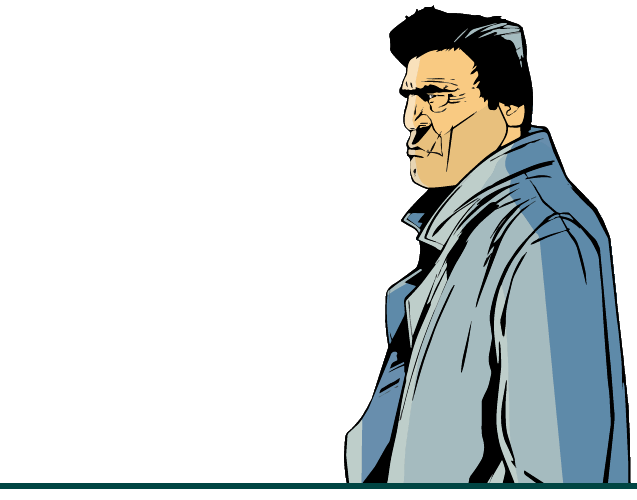

# Аддоны
<!--  -->

В данном разделе я предлагаю несколько интересных дополнений для вашей любимой игры.
По стандарту в сборку некоторые уже встроены и могут быть легко включены через файл `modloader/modloader.ini`.

**Для этого измените значение напротив нужного аддона на любое число выше нуля**
Примеры:
!!! note "Включенный/выключенный аддон (через modloader/modloader.ini)" 
    - Включенный 
    ```(addon) breakable windshields = 100```
    - Выключенный 
    ```(addon) burstable tyres = 0```

0) Русский язык
!!! note ""
    Разумеется, одно из важных дополнений для рускоговорящего GTA-сообщества. Предлагается русификация от фирмы 1C (считайте официальная русификация, так как с ним продаётся не цифровая PC версия).
    Также идёт опция в виде шрифта более низкого качества для аддона классический интерфейс.
    
    Установка:

    `(addon) russian language = 100`
    
    Для классического интерфейса:

    `(addon) russian language classic = 100`

1) Пробиваемые стёкла
!!! note "" 
    `(addon) breakable windshields = 100`

2) Пробиваемые колёса 
!!! note "" 
    `(addon) burstable tyres = 100`

3) Возможность вращать камерой вокруг персонажа как в GTA San Andreas
!!! note "" 
    `(addon) classic axis = 100`

4) Классический интерфейс (Интерфейс в оригинальном, не HD качестве.)
!!! note "" 
    1. Скачать и распаковать архив [[III] Classic Interface.zip](https://drive.google.com/file/d/1s7ux3IRG1zlAxrzyagu5nEhBgBMbF6_2).
    2. Переместить содержимое папки ^^put in the game folder^^ в папку с игрой.
    3. `(dlc) classic interface = 100`

5) Уничтожаемые самолёты
!!! note "" 
    `(addon) destroyable airtrain = 100`

6) Динамические тени
!!! note "" 
    `(addon) dynamic shadows = 100`

7) Скрытый уровень розыска как в GTA San Andreas
!!! note "" 
    `(addon) hide wanted level = 100`

8) Удаление нулей
!!! note "" 
    Данное дополнение убирает нули в отображении интерфейса денег игрока. Таким образом, имея (например) $350, вы будете видеть в интерфейсе "$350", вместо "$00000350".

    `(addon) no money zeros = 100`

9) Возможность вращать камеру в транспорте как в GTA Liberty City Stories
!!! note "" 
    `(addon) lcs vehicle camera = 100`

10) Анимации Клода с ПК версии
!!! note "" 
    `(addon) pc anims = 100`

11) Иконки оружия и радара с ПК версии
!!! note "" 
    `(addon) pc weapons and radar icons = 100`

    For 'Classic Interface' addon:

    `(addon) pc weapons and radar icons classic = 100`

12) Project 2DFX - Увеличение дальности прорисовки источников света
!!! note "" 
    `(addon) project 2dfx = 100`

13) PS2 прицел
!!! note "" 
    `(addon) ps2 crosshair ps2 weapons and radar icons = 100`

    Для аддона 'Classic Interface':

    `(addon) ps2 crosshair ps2 weapons and radar icons classic = 100`

    Для аддона 'PC weapons and radar icons':

    `(addon) ps2 crosshair pc weapons and radar icons = 100`

    Для аддонов 'Classic Interface' и 'PC weapons and radar icons' вместе:

    `(addon) ps2 crosshair pc weapons and radar icons classic = 100`

14) Полицейские кидают шипы

!!! note "" 
    `(addon) stingers = 100`

    ==Использовать только с аддоном "Пробиваемые колёса"==
    

15) Оконный режим без рамки
!!! note "" 
    `(addon) windowed mode = 100`

16) Возможность выбрать режимы EAX, EAX 3.0, A3D и DirectSoundHW для пользователей звуковой карты Creative SoundBlaster
!!! note "" 
    1.  Скачать и распаковать архив [[III] EAX Alchemy Fix.zip](https://drive.google.com/file/d/1WdgPJSgbSc5ed-H3Y0y-hz2KfK8A38pg).
    2. Переместить содержимое папки ^^put in the game folder^^ в папку с игрой.

