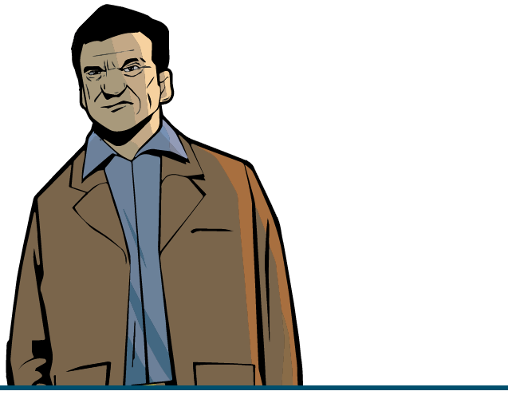
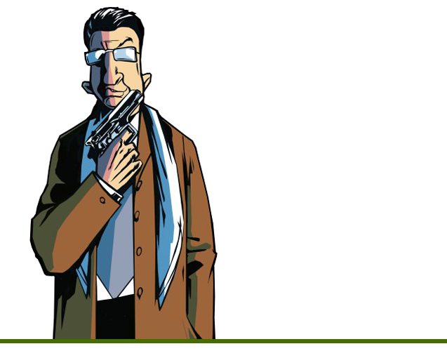

# Скачать
<!--  -->

!!! note
    Updated Classic НЕ требует наличия оригинальной игры или Steam'а. Сборка устанавливается отдельно и Вы можете играть в Updated Classic без Steam'а.

    Мы подписываем версии своих сборок, чтобы было проще ориентироваться со свежестью версий.
    
    На данный момент доступен ^^Build №29^^ для Grand Theft Auto III.

Скачать можно здесь : [Mega](https://mega.nz/file/LpAXzL7A#0Fkx-YtC-tmJuin8_F2Lw1yZihuu_jkTS2EeXk9keAA) / [Google Drive](https://drive.google.com/file/d/19d5hf1e9GIFHc9q8NFXiI_HLQ4H3IvL0) (Размер: 1.05 GB)

## Установка
Сборка легко работает независимо от Steam'а. Но, если хотите играть в неё именно через Steam, то следуйте инструкциям ниже.   

Итак, Вы скачали архив и не знаете, что делать дальше.

1. **Убираем купленное Вами недоразумение:**  
    Для начала нужно удалить все файлы оригинальной Steam-версии игры. 
    
    Для этого кликните по `Grand Theft Auto III` правой кнопкой мыши в Вашей библиотеке `Steam`, и выберите там `Свойства` > `Локальные Файлы` > `Просмотреть Локальные Файлы`.... После данного действия у Вас должна открыться папка с игровыми файлами. Просто удалите из папки всё.

2. **Реабилитация игры**  
    Далее всё просто. Всё, что Вам осталось - распаковать архив UC GTA III Build и положить файлы на место удалённых файлов Steam-версии.

3. **Установите все необходимые для игры компоненты из папки ReadMe/Prerequisites.**  
    Это нужно для корректной работы игры и модов. Может показаться, что это не особо нужный элемент установки, но на самом деле это даёт гарантию, что у вас при запуске не выползет ошибка в духе "Не найден файл.dll". Так что рекомендуем установить их, так как это полезно не только для данной сборки, но и для любых других игр.

    - DirectX Pack - `ReadMe/Prerequisites/Direct X/DXSETUP.exe`
    - Runtime Pack - `ReadMe/Prerequisites/Runtime Pack/RuntimePack_x86_x64.exe`
    - Visual C++ Redistributable Hybrid - `ReadMe/Prerequisites/Visual C++ Redistributable Hybrid/VCR_Hyb_x86_x64_24.04.2019.exe`

!!! note
    Если Вы хотите сразу поставить сборку без скачивания Steam-версии игры, то можете просто использовать соответствующий {++.acf++} файл из архива ниже, который отвечает за наличие установленной игры в Steam.
Скачать:
[Mega](https://mega.nz/folder/ao4ByTRa#tHdTLWa6hiUn-FzcmfqdEA/file/D9olQb4K) / [Google Drive](https://drive.google.com/file/d/1PIGmoXOuI6EXkFPmktnnszwqQ_oGxwY7)

Файл положить в `Steam\steamapps` папку, после установки перезагрузите Steam.
Содержание архива:

- `appmanifest_12100.acf` - Файл для Grand Theft Auto III
- `appmanifest_12110.acf` - Файл для Grand Theft Auto: Vice City
- `appmanifest_12120.acf` - Файл для Grand Theft Auto: San Andreas

## Перед запуском

<!--  -->

Рекомендации перед запуском:

1. **В настройках дисплея включить ограничитель кадров.**

    Это нужно для корректной работы игры. Так как игра не была рассчитана на высокий FPS, из-за него появляются разного рода проблемы: не загружаются некоторые миссии, ломается физика.
    В официальных ReadMe от Rockstar также эта рекомендация присутствует.

2. **Убедитесь, что у вас установлены все необходимые для игры компоненты.**

    Если не уверены, обязательно зайдите в папку `Readme/Prerequisites` и установите:

    - DirectX Pack - `ReadMe/Prerequisites/Direct X/DXSETUP.exe`
    - Runtime Pack - `ReadMe/Prerequisites/Runtime Pack/RuntimePack_x86_x64.exe`
    - Visual C++ Redistributable Hybrid - `ReadMe/Prerequisites/Visual C++ Redistributable Hybrid/VCR_Hyb_x86_x64_24.04.2019.exe`

3. **Задайте значение анизотропной фильтрации в настройках Вашей видео-карты на максимально доступное значение.**

    Это нужно, чтобы текстуры выглядили максимально хорошо. Без применения анизотропной фильтрации, текстуры (в основном дорог) будут размытыми на близких дистанциях.

Если у Вас есть какие-то технические проблемы/вопросы, то смотрите раздел ["Вопросы и ответы"](../gta3/faq.md)

!!! tip "Если у Вас есть проблемы со сборкой" 
    Свяжитесь с нами на нашем Discord сервере(канал "🔨｜support") или в нашей Группе ВК (в личные сообщения группы).

    Если сборка вылетела, пожалуйста, приложите эти файлы к вашему сообщению ДО повторного захода в игру:

     - Grand Theft Auto 3/modloader/modloader.log.
     - Grand Theft Auto 3/mss/scrlog.log.
     - Grand Theft Auto 3/cleo.log.
     - Grand Theft Auto 3/scripts/ucic.log.

## Установка обновлений
!!! warning
    При каждом обновлении мы полностью перезаливаем сборку. Потому, для установки обновления необходимо скачать новый билд Updated Classic и распаковать его в чистую папку.
    
    **Ни в коем случае не устанавливайте обновление поверх предыдущей сборки!**

