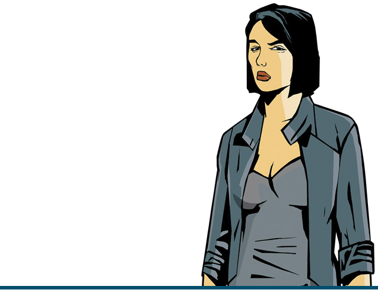

# Вопросы и Ответы
<!--  -->

В этом разделе Вы, возможно, сможете найти ответы на некоторые вопросы, связанные со сборкой (список будет пополняться).

!!! note "Могу ли я ставить сторонние модификации на сборку?"
    Да, но учтите, что это может вызвать различные технические проблемы/ошибки и Вы потеряете нашу поддержку в этих вопросах.

??? note "Какие версии Windows поддерживаются?"
    Windows 7 SP1, 8 и 10.

??? note "Будет ли поддержка мультиплеера Liberty Unleashed или Multi Theft Auto?"
    Нет.

??? note "Игра сильно тормозит"
    1. В файле Grand Theft Auto 3/scripts/GTA3.WidescreenFix.ini у ForceMultisamplingLevel поставьте 0.
    2. Удалите файл Grand Theft Auto 3/mss/scrlog.asi.

    ==ВНИМАНИЕ! Если вы выполните второй шаг - возникнут проблемы с поддержкой!==

??? note "При старте игры вылезает окно с сообщением "AppId is not configured."
    1. Убедитесь, что на пути к EXE файлу нет русских названий. Весь путь к исполняемому файлу должен быть на английском.
    2. Удалите файл Grand Theft Auto 3/mss/GInputIII.asi.
    
    ==ВНИМАНИЕ! После этого действия пропадёт поддержка геймпадов.==

??? note "Игра не запускается/При запуске чёрный экран / При установлении разрешения, соотвествующего разрешению монитора игра зависает/вылетает / Error: Cannot find "1x1x1" video mode."
    1. Обновите DirectX и установите DirectPlay.
    2. Удалите файл Мои Документы/GTA3 User Files/gta3.set.
    3. Поставте совместимость с Windows XP SP3 (например).
    4. В свойствах gta3.exe в вкладке Совместимость нажмите Изменить параметры высокого DPI и установите галочки для:
    "Разрешение программы: когда я открою эту программу"
    "Переопределение масштабирования: Приложение".
    5. В файле Grand Theft Auto 3/scripts/GTA3.WidescreenFix.ini в параметрах ResX и ResY выставить значения разрешения своего монитора.
    Пример:
        `ResX = 1920`
        `ResY = 1080`

??? note "Интро-ролики не работают."
    Поставите Совместимость с Windows XP Service Pack 3 и установите кодеки.

??? note "При запуске игры появляются ошибки Could not detect game version и This game is not supported."
    Удалите файл:
    `Grand Theft Auto 3/scripts/modloader.asi`
    
    ==Внимание! После этого действия некоторые аддоны перестанут работать.==

??? note "Как активировать подсказки с кнопками для геймпада от PS2?"
    В файле Grand Theft Auto 3/mss/GInputIII.ini параметру "PlayStationButtons" поставте значение 1.

??? note "При попытке распаковать архив выдаёт ошибку: Невозможно открыть файл или Архив повреждён."
    Обновите свой архиватор или используйте другой.

??? note "Как включить/выключить "чёрные полосы" в кат-сценах?"
    В Display Setup (в игре) переключите параметр "Wide screen".

??? note "При запуске через Steam игра вылетает без ошибки после интро-роликов."
    Убедитесь, что игра и Steam установлены на одном диске.

??? note "Как настроить управление на геймпаде?"
    В файле Mss/GinputIII.ini найдите параметр "ControlsSet". Все доступные пресеты управления можно найти в ReadMe/Ginput docs/GAME CONTROLS FULL LIST.txt.

??? note "У меня разрешение экрана не 16:9, экраны меню и загрузки не влезают в экран."
    Откройте файл Scripts/GTA3.WidescreenFix.ini, найдите параметры ForceAspectRatio и FrontendAspectRatio, затем выставите им значения Вашего соотношения сторон.
    Пример:
    ```ForceAspectRatio = 16:10
    FrontendAspectRatio = 16:10```

??? note "Какие языки поддерживает сборка?"
    Английский, Французский, Немецкий, Итальянский, Испанский и Русский.

??? note "Я бы хотел вернуть размытие с PS2 версии."
    Удалите файл Scripts/SharpTrails.asi.

??? note "Перед запуском ошибка: "Unable to load rundll32exefix.asi. Error: 193""
    Переместите файл rundll32exefix.asi из папки scripts в папку mss.

??? note "На какой версии игры основана Updated Classic?"
    1.0

??? note "Игра вылетает на загрузке."
    Убедитесь, что ваш анти-вирус не удалил файлы игры. Внесите папку с игрой в исключения и переустановите сборку.


 