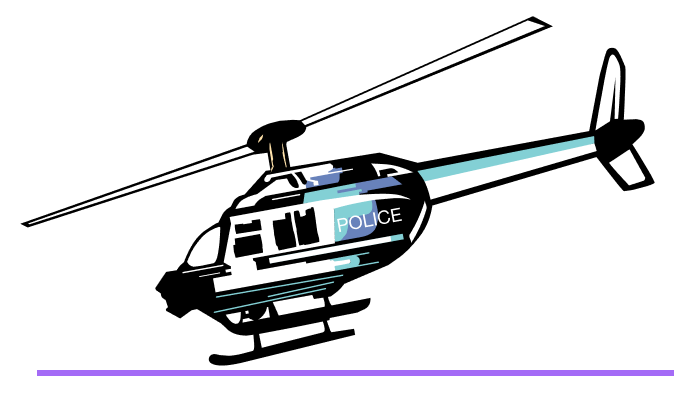
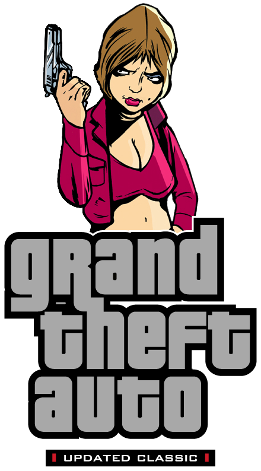
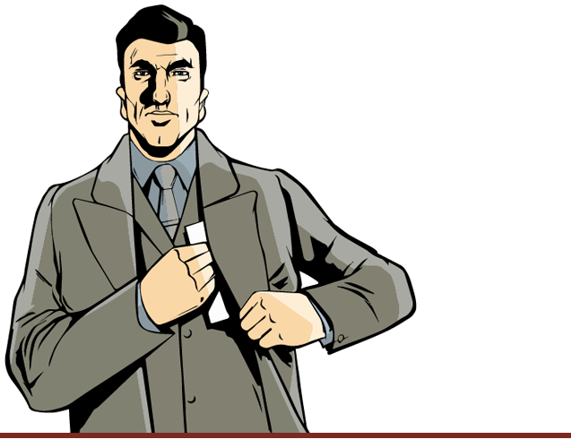

# Особенности

## Отличия от PC версии

{ align=left width="300" }

- Транспортные средства.
- Иконки оружия и радара.
- Цветовая настройка погоды.
- Цвета машин.
- Отражения на машинах.
- Эффекты: Огонь, дождь, дым и брызги воды.
- Загрузочные экраны (сменяющие друг друга, вместо одного статичного на PC).
- Радиостанция Double Clef FM (с восстановленной песней "O mio babbino caro").
- Более лучшее качество звука.
- Подсветка пикапов.
- Свет от фар теперь отображается правильно (один из плюсов оригинальной Steam-версии).
- Звуки полицейских сообщений по рации.
- Камера при входе в транспорт.
- Цветовая коррекция.

Many of the above can be seen in the [Demonstration](demonstration.md) section. 

## Исправления

- Мышь больше не заходит за пределы экрана, что позволяет без проблем играть на нескольких мониторах.
- Более точный подсчёт кадров в секунду, убирающий лаги при включённом ограничителе кадров.
- Игрой не будет запрашиваться компакт-диск, когда все аудио-файлы будут скопированы на диск.
- Чит-код на броню теперь "TORTOISE" - как в версии 1.1.
- Чит-код "BOOOOORING" теперь работает правильно - как в версии 1.1.
- Чувствительность мыши теперь работает правильно - как в версии 1.1.
- Проблема с исчезновением Purple Nines была исправлена.
- Игра теперь работает немного лучше при высоком FPS. Однако, всё ещё есть проблемы с физикой автомобилей, гравитацией и звуками.
- Rhino, созданный чит-кодом больше не остаётся на карте навсегда.
- Blista теперь принимается краном на металлоломе. Однако, теперь там не принимается Coach.
- При стрельбе с M16 от первого лица теперь правильно подсчитывается количество пуль.
- Отражения на мокрых дорогах были исправлены.
- Текст, относящийся к гаражам и rampage'ам, теперь правильно масштабируется по разрешению экрана.
- Весь текст теперь имеет правильные тени (в зависимости от выбранного разрешения).
- Чувствительность мыши по оси Y теперь синхронизирована с X.
- Интерфейс теперь имеет правильный размер относительно разрешения экрана.
- Добавлена полная поддержка геймпадов.
- Добавлены мип-мап уровни для всех игровых текстур.
- Полицейский вертолёт теперь имеет тень.
- Различные исправления на карте.
- В папке "ReadMe" можно найти мануал к игре.
- Баг с чёрными машинами был исправлен.
- Много разных исправлениях на машинах.
- В начальной кат-сцене теперь имеются английские субтитры к сообщениям новостей.
- Игра теперь может использовать до 4 ГБ ОЗУ.
- Исправлено прицеливание с огнемёта.
- (Эксклюзив) Исправлено положение всех бегущих строк.
- Теперь Клод сидит в лодках, а не стоит.
- Отключена Stunt-камера для Dodo.
- (Эксклюзив) Проведён огромный ресёрч всех текстур. Множество из них заменены на лучшие аналоги (не HD).
- Добавлена HD иконка для игры (может быть найдена в Icons папке).
- Пользователи звуковых карт Creative SoundBlaster теперь могут выбрать режимы EAX, EAX 3.0, A3D и DirectSoundHW, используя Creative ALchemy.

## Список изменений

??? note "2020.04.21 - Build 27"
    - Мелкие исправления текстур и коллизий.

??? note "2021.09.30 - Build 28"
    - Интро ролики заменены на PS2 вариант.
    - Исправлена проблема, когда нельзя было нанести урон битой и огнемётом после ~15 минут игры.
    - В миссии 'Under Surveillance' кат-сцена и текст синхронизированы со смыслом миссии.
    - При использовании чит-кода Gesundheit теперь чинится внешний вид транспорта.
    - Огромное количество улучшенных и исправленных коллизий.
    - В озере Бельвиль-Парк теперь есть отражения.
    - Исправлен Ghost.
    - Исправлена стена на стройке Панлантик.
    - ==[Эксклюзив]== Исправлен шрифт в статистике, как в версии 1.01.
    - Airtrain, Deaddodo и Chopper теперь имеют коллизию.
    - Леон Макаффри теперь имеет уникальную модель с головой из LCS.
    - ==[Эксклюзив]== Пешеходу male01 возвращена фраза "I Designed PS2" с PS2 версии.
    - ==[Эксклюзив]== Восстановлены 3 вырезанные, припаркованные машины.
    - ==[Эксклюзив]== Добавлена текстура подошв у Клода.
    - ==[Эксклюзив]== Добавлены фары и хромированный бампер у BF Injection.
    - ==[Эксклюзив]== Исправлен кнут Асуки в кат-сцене миссии 'Grand Theft Aero'.
    - ==[Эксклюзив]== Полицейский код 48 (превышение скорости) больше не проигрывается.
    - Пути Deaddodo заменены на оригинальные.
    - ==[Эксклюзив]== Уникальные полицейские переговоры в миссиях взяты с PS2.
    - Анимация бега Клода заменена на PC версию.
    - Исправлена модель Dodo.
    - ==[Эксклюзив]== Исправлено отсутствие цифры 2 на одной из гаражной двери в Портленде.
    - ==[Эксклюзив]== Четвёрный безумный трюк теперь можно получить.
    - ==[Эксклюзив]== В миссиях 'Bling-Bling Scramble' и 'Plaster Blaster' теперь по 3 пути, как на PS2.
    - У дома сохранения в Шорсайде теперь открываются все 3 двери гаража.
    - Исправлена проблема, когда при заходе в служебный транспорт высвечивалась радиостанция 'Radio Head'.
    - Исправлены проблемы с цветами FBI Car.
    - ==[Эксклюзив]== Во время титров больше не видно Клода в некоторых местах.
    - ==[Эксклюзив]== Различные исправления в тексте (Английский).
    - ==[Эксклюзив]== Исправлено двойное появление Клода в кат-сцене миссии 'Last Requests'.
    - ==[Эксклюзив]== Securicar в миссиях 'Escort Service' и 'Decoy' теперь имеет правильные цвета.
    - ==[Эксклюзив]== Многочисленные исправления моделей и текстур.
    - ==[Эксклюзив]== Исправлена проблема, когда карта радара вылезала за рамки радара.
    - ==[Эксклюзив]== Различные исправления на карте.
    - ==[Эксклюзив]== Исправлена высота маркера в миссии 'Uzi Rider'.
    - Исправлена разрушаемость столбов.
    - ==[Эксклюзив]== Улучшены дома в Hepburn Heights. Теперь у них есть подъезды и ночные огни, по аналогии с домами из Шорсайда.
    - ==[Эксклюзив]== Исправлен Клод во вступительной кат-сцене.

    - HD Interface:
        - Улучшены иконки оружия.
        - ==[Эксклюзив]== Исправлена проблема, когда карта радара вылезала за рамки радара.

    - Russian Language:
        - Добавлена русифицированная газета.

??? note "2022.12.30 - Build 29"
    - Большинство аддонов (включая новые) теперь встроены в игру и управляются через файл modloader/modloader.ini.
    - Встроенные аддоны:
        - Разбиваемые стёкла у машин;
        - Пробиваемые шины у машин;
        - Возможность крутить камерой вокруг игрока как в GTA San Andreas;
        - Уничтожаемые самолёты;
        - Динамические тени для персонажей и транспорта;
        - Звёзды розыска не показываются когда уровень розыска 0;
        - Возможность крутить камерой в транспорте как в GTA Liberty City Stories;
        - Убирание нулей в интерфейсе денег;
        - Анимации Клода из ПК версии;
        - Иконки оружия и иконки на радаре из ПК версии;
        - Иконки оружия и иконки на радаре из ПК версии (в классическом разрешении);
        - Увеличение дальности прорисовки источников света;
        - PS2 прицел с иконками оружия и иконками радара из ПК версии;
        - PS2 прицел с иконками оружия и иконками радара из ПК версии (в классическом разрешении);
        - PS2 прицел с иконками оружия и иконками радара из PS2 версии;
        - PS2 прицел с иконками оружия и иконками радара из PS2 версии (в классическом разрешении);
        - Русский язык;
        - Русский язык (в классическом разрешении);
        - Полицейские кидают шипы (использовать только с аддоном на пробиваемые шины у машин);
        - Оконный режим без рамок;
    - Загружаемые аддоны:
        - Классический интерфейс;
        - EAX Alchemy Fix;

    - Члены банды Ярди теперь имеют разные скины.
    - Столбы в Shoreside Vale теперь разрушаемые.
    - ==[Эксклюзив]== Большое количество исправлений на карте:
        - Исправления прелайта у объектов;
        - Исправления отсутствующих или перевёрнутых текстур;
        - Исправления UV-маппинга;
        - Исправления некорректных позиций у объектов (объекты висели в воздухе или были под картой);
        - Прочие мелкие исправления;
        - Руки Колумбийцев во вступительной кат-сцене миссии "The Exchange" повёрнуты на 180 градусов.
        - Большое количество исправлений транспортных средств.
        - (Английский) Исправлены субтитры в миссиях "Bling-Bling Scramble", "UZI Rider", "Gangcar Round-Up" и "Kingdom Come".
        - Добавлен чит-код на большие головы как в GTA Liberty City Stories. Комбинация - BOBBLEHEADS.
        - Весь интерфейс по умолчанию теперь в HD качестве с эксклюзивными правками.
        - Исправлена шея Каталины.
        - Исправлены некоторые скины банд.
        - ==[Эксклюзив]== Добавлена небольшая детализация в район Pike Creek из официальных вырезанных мультиплеерных карт.
        - ==[Эксклюзив]== Большой перенос пропов из GTA Liberty City Stories:
            - Маяк;
            - Парковка у SupaSave в Portland'е;
            - Камни у дамбы в Shoreside Vale;
            - Мусорные баки и мешки;
            - Провода;
            - Пожарные лестницы;
            - Бурящие машины в туннеле Shoreside Vale;
            - Ночные огни у домов в Portland'е;
            - Туристическая будка у метро в Shoreside Vale;
            - Гараж у дома Тони в Shoreside Vale;
            - Прочие мелкие пропы и улучшения;
        - ==[Эксклюзив]== Множественное добавление различных эффектов, источников света и детализации на карту:
            - Дым из вентиляций и свет для антенны на здании Head Radio;
            - Огромная детализация двора за рестораном Тони: окна, забор, пожарные лестницы, источники света;
            - Огни на взлётно-посадочных полосах в аэропорту;
            - Детализация + добавление источников света на стадион в Staunton Island;
            - Порт в Portland'е;
            - Заправка и автосалон Easy Credit Autos в Portland'е;
            - Детализация горы на севере города;
            - Особняку Колумбийцев в Shoreside Vale добавлен LOD;
            - Камням в воде добавлен LOD;
            - Клумбы для деревьев, которые изначально были в асфальте;
            - Перекрёсток у моста Каллахан в Portland'е;
            - Улучшены билборды Rockstar;
            - Исправление геометрии, текстур, прелайта и теней в Belleville Park;
            - Детализация дома Леона МакКефри;
            - Добавлены мерцающие огни на подъёмном мосту между Staunton'ом и Shoreside Vale;
            - Прочие мелкие улучшения и источники света;
        - ==[Эксклюзив]== На радаре теперь отображаются Pay'n'Spray, Ammu-Nation и гараж 8-Ball'а после прохождения соответствующих миссий.
        - Обновлены плагины.
        - Исправлена проблема с дальностью прорисовки самолётов (путём убирания у них коллизии).
        - ==[Эксклюзив]== Исправлены текстуры пикапа платинума в миссии 'Bullion Run', как на PS2.
        - ==[Эксклюзив]== Теперь вы будете видеть сообщение "Миссия Пройдена" после финальных титров в 'The Exchange'.
        - ==[Эксклюзив]== Исправлен один неправильный кусок железной дороги в Portland'е.

